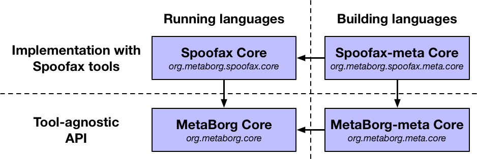
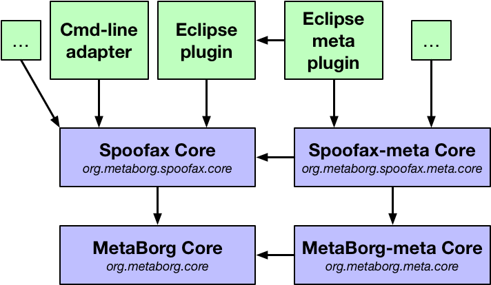
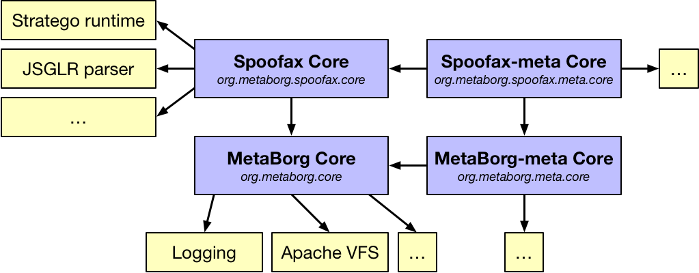

============
Architecture
============

Components
----------

Spoofax Core consists of four components implemented as Java libraries:

- MetaBorg Core (`org.metaborg.core <https://github.com/metaborg/spoofax/tree/master/org.metaborg.core>`_)
- Spoofax Core (`org.metaborg.spoofax.core <https://github.com/metaborg/spoofax/tree/master/org.metaborg.spoofax.core>`_)
- MetaBorg-meta Core (`org.metaborg.meta.core <https://github.com/metaborg/spoofax/tree/master/org.metaborg.meta.core>`_)
- Spoofax-meta Core (`org.metaborg.spoofax.meta.core <https://github.com/metaborg/spoofax/tree/master/org.metaborg.spoofax.meta.core>`_)

The architecture of these components is as follows:

   Architecture with components identified by their name and artifact identifier, with dependencies on each other.

Spoofax Core can be separated into components that *run* languages (left), and ``-meta`` components that *build* languages (right), with dependencies flowing from right to left. This separation was made so that the functionality of running languages could be deployed without requiring the functionality of building languages. We think this is also a good separation of concerns, minimizing the responsibilities of each component.

The components can also be separated into ``Spoofax`` components that provide *concrete implementations* (top), and ``MetaBorg`` components that provide an *API* without tool-specific implementations (bottom), with dependencies flowing from top to bottom. This split separates the concerns of complex tool implementaitons, with the API that is required to run those tools. This enables generic implementations on top of the API, that do not depend on concrete tool implementations. For example, the concern of dynamically loading languages is implemented generically in ``org.metaborg.core``.

Adapters and Plugins
--------------------

Adapters and plugins adapt Spoofax(-meta) Core to other platforms. For example, the following figure shows a command-line (Cmd-line) adapter, Eclipse plugin, and a Maven plugin:

   Architecture with adapters and plugins based on Spoofax Core components.

The command-line adapter provides a batch command-line interface to running languages in Spoofax Core. It only needs to depend on Spoofax Core, not Spoofax-meta Core, because it is only *running* languages, not building them.
The Eclipse plugin runs Spoofax languages in the Eclipse IDE, enabling programs of Spoofax languages to be displayed in editors, with editor services such as error markers and syntax highlighting.
The Eclipse meta plugin is a separate plugin for *building* Spoofax languages. With this architecture, the Eclipse meta plugin can also be deployed separately from the Eclipse plugin that just *runs* languages.

We have developed the following adapters and plugins:

- `Sunshine (command-line adapter) <https://github.com/metaborg/spoofax-sunshine>`_
- `Maven plugin <https://github.com/metaborg/spoofax-maven>`_
- `Eclipse plugin <https://github.com/metaborg/spoofax-eclipse>`_
- `IntelliJ plugin <https://github.com/metaborg/spoofax-intellij>`_

Dependencies
------------

Components have several internal and external dependencies, where internal dependencies are developed as part of the Spoofax ecosystem, and external dependencies are third-party Java libraries. The following figure shows some of these dependencies:

   Architecture including some external dependencies.

For example, Spoofax Core depends on the Stratego runtime and JSGLR parser which are developed internally, whereas MetaBorg core only depends on basic third-party libraries like logging and a file system abstraction (VFS). The dependencies for each component are listed in their Maven :file:`pom.xml` files:

- `org.metaborg.core <https://github.com/metaborg/spoofax/blob/master/org.metaborg.core/pom.xml>`_
- `org.metaborg.spoofax.core <https://github.com/metaborg/spoofax/blob/master/org.metaborg.spoofax.core/pom.xml>`_
- `org.metaborg.meta.core <https://github.com/metaborg/spoofax/blob/master/org.metaborg.meta.core/pom.xml>`_
- `org.metaborg.spoofax.meta.core <https://github.com/metaborg/spoofax/blob/master/org.metaborg.spoofax.meta.core/pom.xml>`_

Versions for most dependencies are managed in the ``dependencyManagement`` section of the `parent POM file <https://github.com/metaborg/spoofax-deploy/blob/master/parent/pom.xml>`_.
Dependencies with version ``${metaborg-version}`` denote internal dependencies.
When embedding Spoofax Core into an application, both external and internal dependencies must be embedded.
