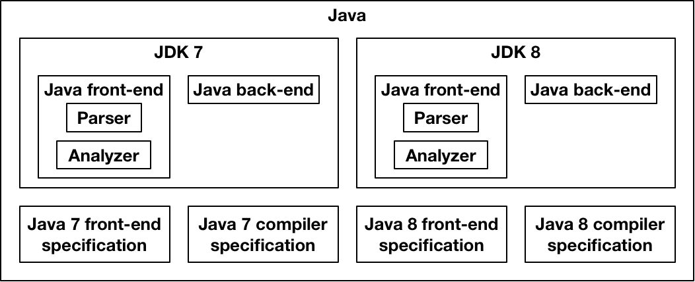

========
Concepts
========

Spoofax has several cross-cutting concepts that are used within Spoofax Core.
This manual describes those concepts.

Languages
---------

Spoofax runs and builds languages, so it has several concepts related to languages.

Example
~~~~~~~

We will explain these concepts by using the structure of a Java compiler as example in the following image:

   Part of the internal structure of the JDK7 and 8 compilers.

A Java compiler has a *front-end* that *parses* and *analyzes* Java programs.
The front-end is specified as a PDF or (hopefully) as an executable *specification*.
It also has a *back-end* that compiles Java programs into Java bytecode, with a specification.
The front-end and back-end together compose a Java compiler, such as the *Java Development Kit version 7 (JDK7)*.
Similarly, a front-end and back-end for Java 8 form *JDK8*.
Together, JDK7 and JDK8 are part of the *Java* series of compilers, with JDK8 being the latest one.

Language Component and Facets
~~~~~~~~~~~~~~~~~~~~~~~~~~~~~

In Spoofax, the front-end and back-end are **language components** (:java:ref:`~org.metaborg.core.language.ILanguageComponent` in the source code).
A language component implements a part of the language.
They have an identifier and are versioned, which together form a unique identifier.

The functionality inside a language component, such as the parser and analyzer in the front-end, are **language facets** (:java:ref:`~org.metaborg.core.language.IFacet`).
A language facet is an implementation of a facet of a language, that Spoofax knows how to execute.

Language Specifications
~~~~~~~~~~~~~~~~~~~~~~~

The specification of the front-end and back-end components are **language specifications** (:java:ref:`~org.metaborg.spoofax.meta.core.project.ISpoofaxLanguageSpec`).
A language specification implements or specifies (in meta-languages) a part of the language.
A single language specification is compiled by Spoofax into a single language component.

Dependencies
~~~~~~~~~~~~

Language specifications have two types of dependencies.
A **compiler dependency** (:java:ref:`~org.metaborg.core.build.dependency.IDependencyService.compileDeps(IProject)`) indicates that when a language specification is compiled, the compiler of a different language component should be executed first.
For example, if JDK7 and JDK8 were specified in SDF, the specifications need a compiler dependency on the SDF compiler, to translate the SDF grammar into a parse table.

A **source dependency** (:java:ref:`~org.metaborg.core.build.dependency.IDependencyService.sourceDeps(IProject)`) indicates a dependency on source files of another language specification.
For example, a JDK back-end needs to depend on the AST signatures of the front-end, to be able to pattern match parsed terms.
We can also use source dependencies to depend on libraries.
For example, a JDK front-end can depend on the NaBL analysis library, which contains reusable functionality for executing name analysis with NaBL.

Composing Language Implementations
~~~~~~~~~~~~~~~~~~~~~~~~~~~~~~~~~~

The JDK7 and JDK8 compositions of their front and back-ends are **language implementations** (:java:ref:`~org.metaborg.core.language.ILanguageImpl`) in Spoofax.
A language implementation is simply a collection of language components.
Like language components, language implementations have an identifier and version, which together form a unique identifier.

Most of the user-facing Spoofax Core API works with language implementations, such that using a language does not require manual composition of components.
The main exceptions to this are the compiler dependencies described earlier, and loading a language into Spoofax, which loads language components.
The internals of Spoofax Core deal with the composition of language facets in language components of language implementations.
For example, a language implementation with multiple components could provide multiple menu facets, which the the menu service composes into one menu that is shown to the user.

Language Series
~~~~~~~~~~~~~~~

Finally, the Java series of compilers is called a **language** (:java:ref:`~org.metaborg.core.language.ILanguage`) in Spoofax.
A language is a collection of language implementations.
It does not have an identifier or version, just a name.
Within a language, there is the concept of the **active language implementation** (:java:ref:`~org.metaborg.core.language.ILanguage.activeImpl()`) , which is the language implementation with the highest version.
This is JDK8 in the example.

Projects
--------

Projects in Spoofax are used to host language specifications and programs of a language.

An **end-user project** (:java:ref:`~org.metaborg.core.project.IProject`) is a project that contains programs of languages, intended to be developed by an end-user of those languages.

A **language specification project** (:java:ref:`~org.metaborg.spoofax.meta.core.project.ISpoofaxLanguageSpec`), sometimes called a language project, is a project that contains a languages specification. A language specification contains programs of meta-languages, intended to be developed by a language developer.
A language specification project is a specialization of an end-user project.
