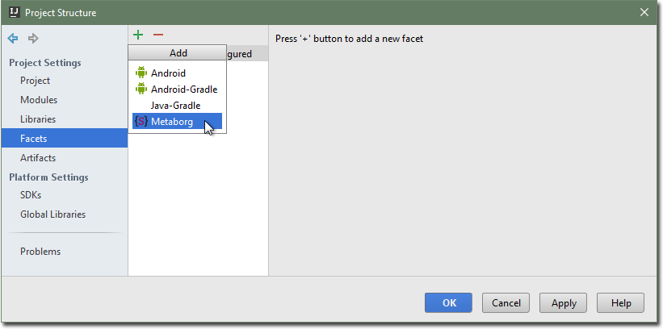

# Importing an existing project
Follow this quick start guide to change an existing Java project such that you
can use Metaborg languages in it.

1. Open the project in IntelliJ IDEA.

2. Go to the _Project Structure_ dialog, either through the _File_ →
   _Project Structure..._ menu item, or by pressing <kbd>Ctrl</kbd>+
   <kbd>Alt</kbd>+<kbd>Shift</kbd>+<kbd>S</kbd>.

3. Go to the _Facets_ tab.

4. Click the  button and select _Metaborg_ from the
   drop-down menu.

   

5. Select the module to add the facet to, and click _OK_.

6. In the _Modules_ tab, select the module.

7. Go to the _Dependencies_ tab.

8. Select the _Metaborg SDK_ as the module's SDK.

   

   ```eval_rst
   .. include:: module-sdk.txt
   ```

5. Click _OK_ to apply the changes.

The Java project will have the _Metaborg facet_, indicating that the
project uses Metaborg languages. It will also have a `metaborg.yaml` file,
which specifies the language dependencies of the project.
