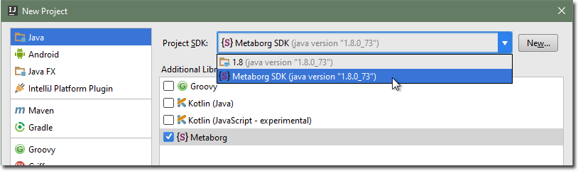
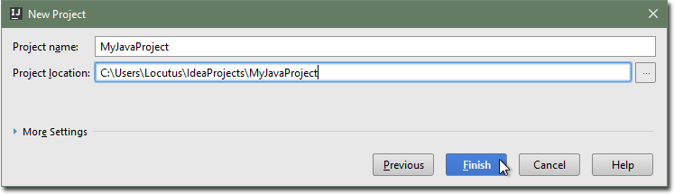

# Creating a new project
Follow this quick start guide to create a new Java project in which you can use
Metaborg languages.

1. Choose _Create New Project_ from the welcome dialog, or the _File_ → _New_ →
_Project..._ menu item, to open the _New Project_ dialog.

2. Select the _Java_ project type.

3. Check the _Metaborg_ framework.

   

4. Select the _Metaborg SDK_ as the project's SDK.

   

   ```eval_rst
   .. include:: new-project-sdk.txt
   ```

5. Click _Next_.

6. Pick a project name and location, and click _Finish_.

   

The created Java project will have the _Metaborg facet_, indicating that the
project uses Metaborg languages. It will also have a `metaborg.yaml` file, which
specifies the language dependencies of the project.
