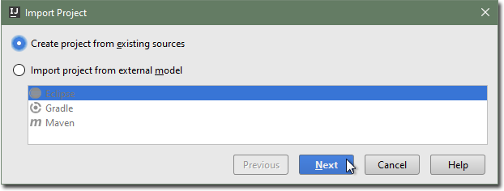

# Importing an existing language specification
Follow this quick start guide to import an existing Spoofax language
specification into IntelliJ.

1. Choose _Import Project_ from the welcome dialog, or the _File_ → _New_ →
_Project from Existing Sources..._ menu item, to open the _Import Project_
dialog.

2. Browse to the root folder of the project, and click _OK_.

   

3. Select _Create project from existing sources_ and click _Next_.

   

4. Pick a project name, and ensure the location is correct. Click _Next_.

5. Ensure both the _Java_ and _Spoofax module_ roots are checked.

   

6. Click _Finish_.

The imported Spoofax language specification project has a `metaborg.yaml`
file, which specifies the configuration and language dependencies of the
specification.
