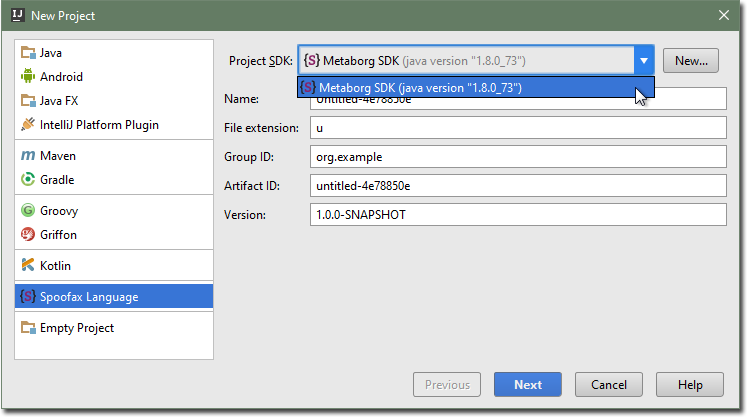

# Creating a new language specification
Follow this quick start guide to create a new Spoofax language specification
project to define your own language.

1. Choose _Create New Project_ from the welcome dialog, or the _File_ → _New_ →
_Project..._ menu item, to open the _New Project_ dialog.

2. Select the _Spoofax Language_ project type.

3. Select the _Metaborg SDK_ as the project's SDK.

   

   ```eval_rst
   .. include:: new-langspec-sdk.txt
   ```

4. Change the fields to suit your needs.

   

5. Click _Next_.

6. Pick a project name and location, and click _Finish_.

   

The created Spoofax language specification project will have a `metaborg.yaml`
file, which specifies the configuration and language dependencies of the
specification.
