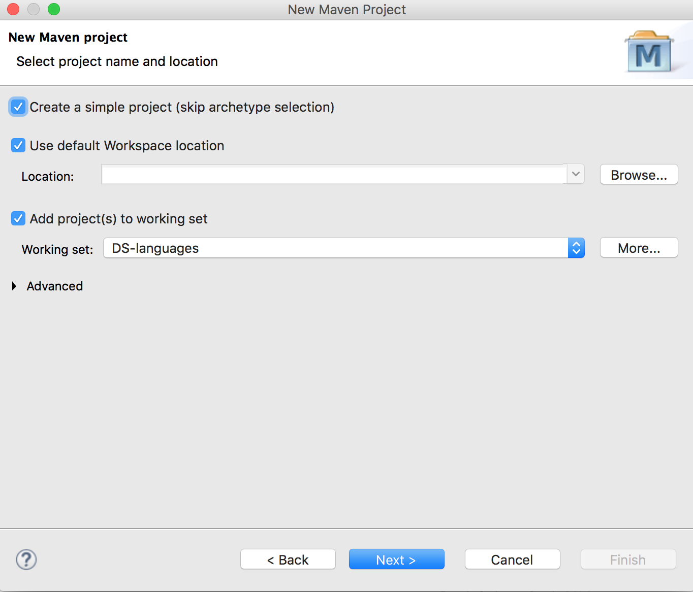
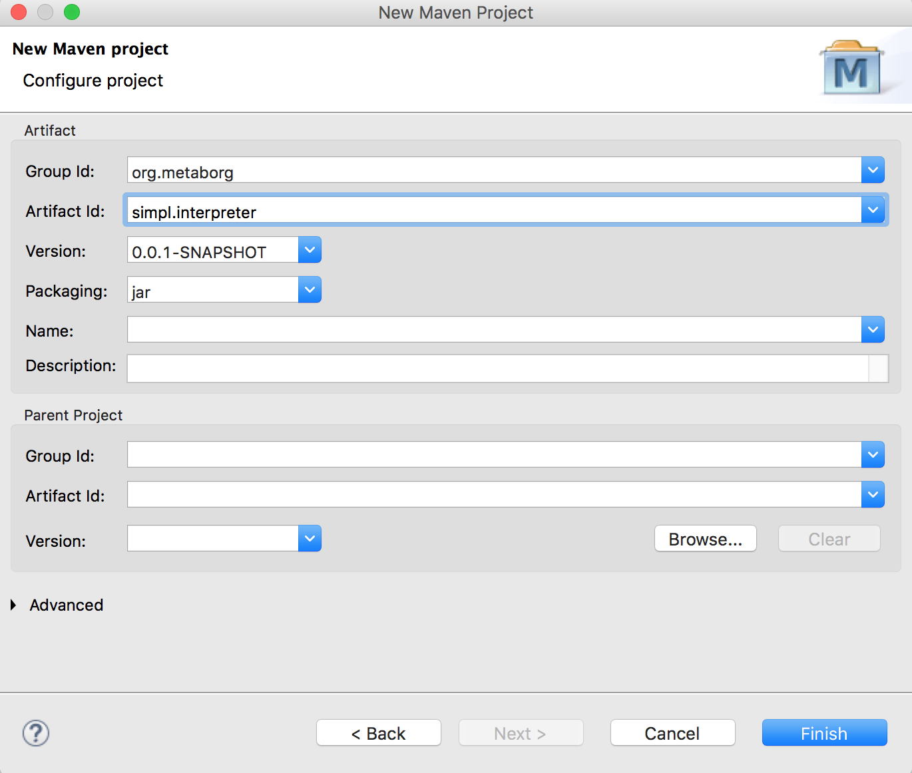
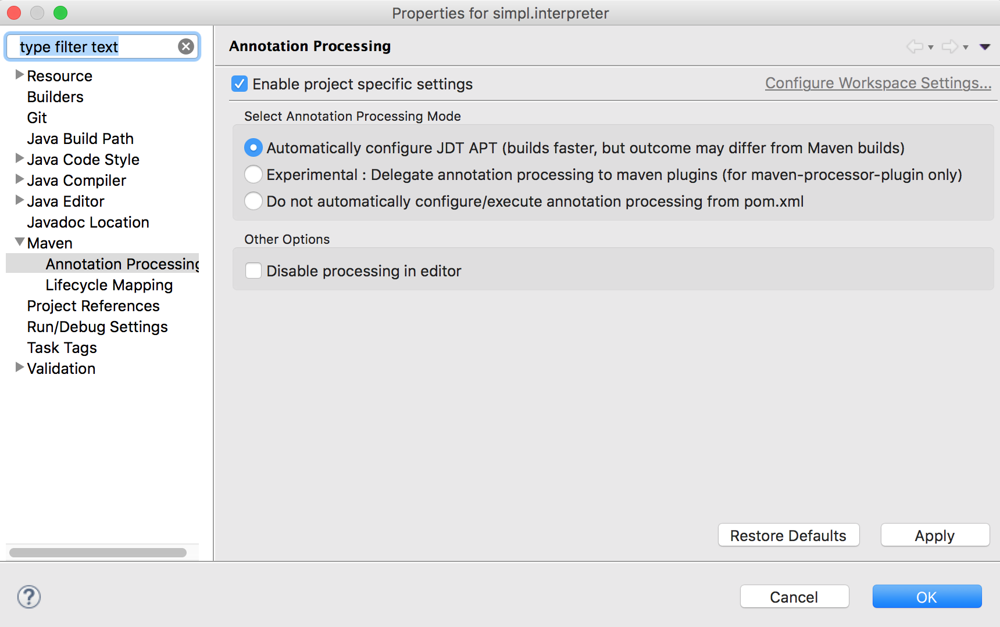
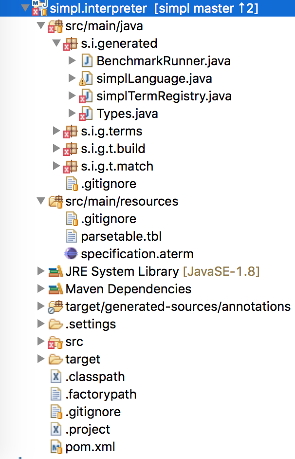
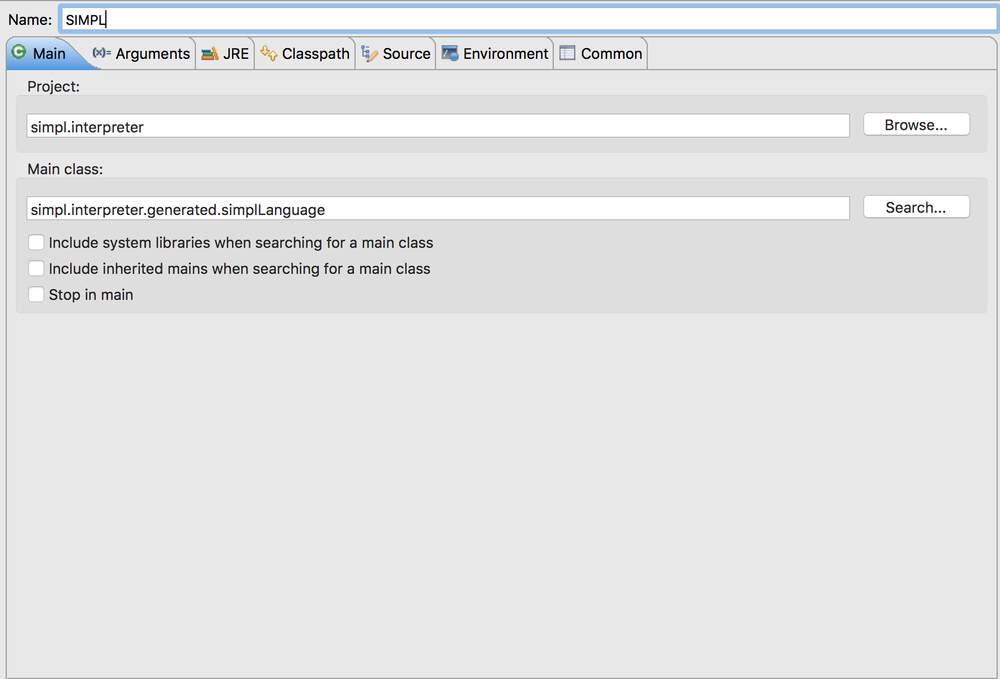
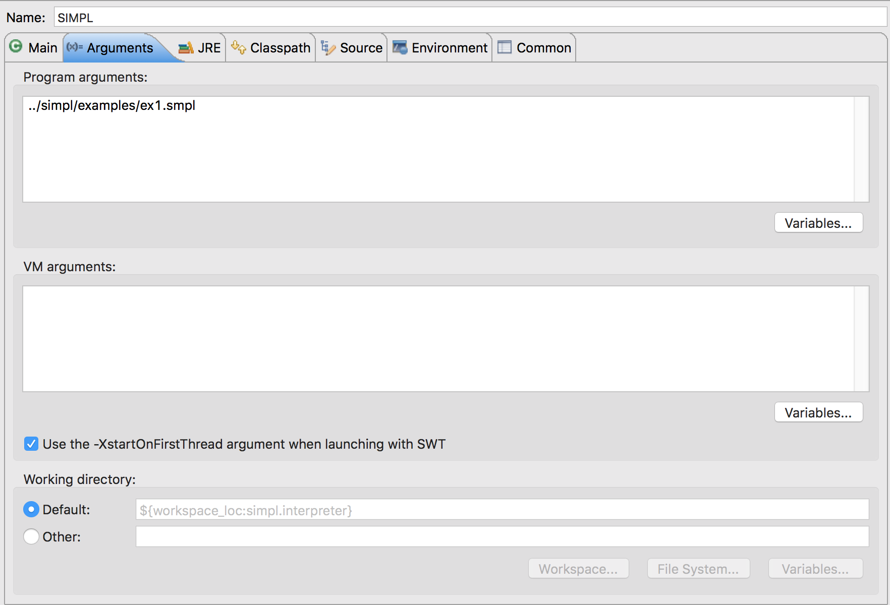

===============
Getting started
===============

This guide will get you started with DynSem to specify the dynamic semantics of your language. You'll be guided through:

1. `Defining your first DynSem module`_
2. `Specifying context-free language constructs`_
3. `Specifying context-sensitive language constructs`_
4. `Specifying semantics for conditional language constructs`_
5. `Using meta-functions to create semantic libraries`_
6. `Preparing an interpreter for an object language`_
7. `Extending specifications with native operations`_
8. `Evaluating an object language program in an interpreter`_

.. 7. `Writing to standard output and reading standard input`_
.. 8. `Interacting with native data types`_
.. 9. `Interacting with the interpreter from Java`_

---------------------------------------
The *SIMPL* language as running example
---------------------------------------

This guide is centered around a very simple language we call *SIMPL*. The *SIMPL* code is maintained in it's own `GitHub SIMPL repository`_. We start with a basic definition (in `SDF3`_) of concrete syntax which covers arithmetic expressions:

.. code-block:: sdf3
  :linenos:

  context-free start-symbols
    Exp

  context-free syntax
    Exp.Lit   = <<INT>>
    Exp.Plus  = <<Exp> + <Exp>> {left}
    Exp.Minus = <<Exp> - <Exp>> {left}
    Exp.Times = <<Exp> * <Exp>> {left}
    Exp = <(<Exp>)> {bracket}

Note that terms of the sort ``Exp`` are start symbols for *SIMPL* programs.

---------------------------------
Defining your first DynSem module
---------------------------------

We create the main DynSem module named *trans/simpl* in the file `trans/simpl.ds`:

.. code-block:: dynsem
  :linenos:

  module trans/simpl

  imports
    src-gen/ds-signatures/simpl-sig

The module imports the abstract syntax definitions (term signatures) which is generated from the concrete syntax definition:

.. code-block:: dynsem
  :linenos:

  module ds-signatures/simpl-sig

  imports ds-signatures/Common-sig

  signature
    sorts
      Exp
    constructors
      Lit : INT -> Exp
      Plus : Exp * Exp -> Exp
      Minus : Exp * Exp -> Exp
      Times : Exp * Exp -> Exp

Importing these makes the sorts and constructors available to the rest of the modules. We extend module *trans/simpl* with definitions for value sorts and for the main reduction relation:

.. code-block:: dynsem
  :linenos:

  module trans/simpl

  imports
    src-gen/ds-signatures/simpl-sig

  signature
    sorts
      V
    constructors
      NumV: Int -> V
    arrows
      Exp --> V
    variables
      v : V

We declared constructor ``NumV`` which will be used to represent numerical value terms. We also declare reduction relation ``Exp --> V`` from ``Exp`` terms to values ``V``, and a variable scheme for variables named **v**. For details about the signature section of DynSem specification see the :ref:`dynsemreference`.

-------------------------------------------
Specifying context-free language constructs
-------------------------------------------

We specify reduction rules for *SIMPL* constructs that do not depend on the evaluation contexts (such as environments). These are *number literals*, and simple *arithmetic operations*. The reduction rules are given in a big-step style:

.. code-block:: dynsem
  :linenos:

  rules
    Lit(s) --> NumV(parseI(s)).

    Plus(e1, e2) --> NumV(addI(i1, i2))
    where
      e1 --> NumV(i1);
      e2 --> NumV(i2).

The first rule specifies that literal terms such as ``42`` whose abstract syntax is of the form ``Lit("42")`` evaluate to ``NumV`` terms. The second rule specifies the semantics of the addition expressions of the form ``Plus(e1, e2)`` inductively on the default reduction relation. First the expression **e1** is reduced and the expectation is that it reduces to a ``NumV`` term. Variable **i1** is bound to the integer value surrounded by the resulting ``NumV`` term. This is captured in the first premise of the reduction rule. Similarly, the reduction of the right expression of the addition is captured in the second premise. The conclusion of the rule composes the two integers to a ``NumV`` term.

In the rules above, ``parseI`` and ``addI`` are native operators which we provide the functionality of parsing a string into an integer, and of adding two integers, respectively. We provide the signatures for these when we look at `Extending specifications with native operations`_.

.. note:: Dissimilar to regular big-step style rules, premises in DynSem are ordered. The ``Plus`` rule above states that the left expression will be evaluated first and the right expression second.

The rules for subtraction and multiplication proceed similarly:

.. code-block:: dynsem
  :linenos:

  Minus(e1, e2) --> NumV(subI(i1, i2))
  where
    e1 --> NumV(i1);
    e2 --> NumV(i2).

  Times(e1, e2) --> NumV(mulI(i1, i2))
  where
    e1 --> NumV(i1);
    e2 --> NumV(i2).

In all three rules seen so far ( ``Plus``, ``Minus``, ``Times`` ) the reductions for the subexpressions can be specified implicitly:

.. code-block:: dynsem
  :linenos:

  Plus(NumV(i1), NumV(i2)) --> NumV(addI(i1, i2)).
  Minus(NumV(i1), NumV(i2)) --> NumV(subI(i1, i2)).
  Times(NumV(i1), NumV(i2)) --> NumV(mulI(i1, i2)).


Specifying the reductions and term expectations implicitly allows rules to be written more concisely without creating ambiguities.

.. note:: Implicit reductions are applied in left-to-right order and expand to the explicit form of the rules.

------------------------------------------------
Specifying context-sensitive language constructs
------------------------------------------------

We define *SIMPL* language constructs whose semantics depend on the evaluation context. First we extend the syntax definition of *SIMPL* with *let*-expressions:

.. code-block:: sdf3
  :linenos:

  context-free syntax
    Exp.Let = <let <ID> = <Exp> in <Exp>> {non-assoc}
    Exp.Var = <<ID>>

This accepts expressions that bind and read variables. An example of a such a program is:

.. code-block:: none

  let x = 40 in x + 2

We expect the program above to evaluate to ``NumV(42)`` and extend the semantics of *SIMPL* with the following definitions:

.. code-block:: dynsem
  :linenos:

  signature
    sort aliases
      Env = Map<String,V>

  rules
    Env e |- Let(x, e1, e2) --> v2
    where
      Env e |- e1 --> v1;
      Env {x |--> v1, e} |- e2 --> v2.

    Env e |- Var(x) --> e[x].

The ``signature sort aliases`` subsection defines ``Env`` as an alias for an associative array from ``String`` to ``V``. We use this associative array as the evaluation context for variables - variable environment. The environment will be propagated downwards in the evaluation tree.


Looking at the first rule, it reduces a ``Let`` term to a value by first reducing the variable expression in the surrounding environment and then reducing the body expression in the updated environment. The variable environment ``Env e`` is received into the reduction rule together with the ``Let`` expression to be reduced, and it is propagated downwards in the evaluation tree of the premises. Updates to the environment are not visible upwards in the evaluation tree. The second rule reduces `Var` expressions to the value associated with the variable name in the variable environment.


.. note:: Terms left of the ``|-`` symbol are called *read-only semantic components*.

Although we have extended *SIMPL* with context-sensitive constructs we do not have to modify the reduction rules which are context-independent. DynSem reduction rules do not need to explicitly propagate semantic components that they do not depend on.

We illustrate the principle of implicit propagation by further extending *SIMPL* with mutable variable boxes:

.. code-block:: sdf3
  :linenos:

  context-free syntax
    Exp.Box = <box(<Exp>)>
    Exp.Unbox = <unbox(<Exp>)>
    Exp.Setbox = <setbox(<Exp>, <Exp>)>

This accepts programs that use mutable variables. The ``Box`` expression allocates a new box on the heap and puts the result of the expression in the box, evaluating to a box value. The ``Unbox`` expression reads the value inside the box provided by the argument expression. The ``Setbox`` expression puts the value of the second expression inside the box provided by the first expression. For example, a valid program could be:

.. code-block:: none

  let b = box(40) in setbox(b, unbox(b + 2))

We extend the DynSem specification with the following signature and reduction rules for box operations:

.. code-block:: dynsem
  :linenos:

  signature
    constructors
      BoxV: Int -> V
    sort aliases
      Heap = Map<Int, V>

  rules
    Box(e) :: Heap h --> BoxV(addr) :: Heap {addr |--> v, h'}
    where
      e :: Heap h --> v :: Heap h';
      fresh => addr.

    Unbox(e) :: Heap h --> h'[addr] :: Heap h'
    where
      e :: Heap h --> BoxV(addr) :: Heap h'.

    Setbox(box, e) :: Heap h --> v :: Heap {addr |--> v, h''}
    where
      box :: Heap h --> BoxV(addr) :: Heap h';
      e :: Heap h' --> v :: Heap h''.

where ``BoxV`` is a new *SIMPL* value representing the address of a box in the heap ``Heap``. The ``Box`` reduces to a ``BoxV`` value by reducing the subexpression to a value, obtaining a new unoccupied address using the ``fresh`` primitive. It extends the incoming ``Heap`` with a new entry for the evaluated expression at the new address. The ``Unbox`` rule reduces the subexpression to a box value and looks up the associated value in the ``Heap``.

.. note:: Terms to the right side of ``::`` symbol are called *read-write semantic components*. They are woven through the evaluation tree and updates to them are made visible upwards in the evaluation tree.

Similarly to the addition of the *let*-expression, extending with a heap structure and mutable variables does not require changing the existing reduction rules. Rules do not have to explicitly mention (or handle) read-write components which they do not depend on. The SIMPL repository at `tags/let-and-boxes-verbose`_ contains the complete dynamic semantics specification for *SIMPL*.

--------------------------------------------------------
Specifying semantics for conditional language constructs
--------------------------------------------------------

We illustrate how to specify the semantics of a conditional language construct by introducing an ``ifz`` expression in *SIMPL*. Extend the syntax definition of *SIMPL* with the following:

.. code-block:: sdf3
  :linenos:

  context-free syntax
    Exp.Ifz = <ifz <Exp> then <Exp> else <Exp>>

The ``ifz`` expression executes the ``then`` expression if the condition expression evaluates to ``0``, or executes the ``else`` expression otherwise. An example of a valid *SIMPL* program is:

.. code-block:: none
  :linenos:

  let iszero = a -> ifz(a) then 1 else 0
  in iszero(42)

We extend the semantics with the following DynSem rule:

.. code-block:: dynsem
  :linenos:

  rules
    Ifz(NumV(ci), e1, e2) --> v
    where
      case ci of {
        0 =>
          e1 --> v
        otherwise =>
          e2 --> v
      }.

The condition expression is first evaluated to a ``NumV``. Using the case pattern matching premise (:ref:`dynsemreference`) the two cases of interest are specified.

-------------------------------------------------
Using meta-functions to create semantic libraries
-------------------------------------------------

To keep reduction rules concise and simple it is useful to introduce layers of abstraction over common semantic operations. For example, in the case of *SIMPL* we can abstract away from much of the operations that depend on the variable environment and the heap. Instead of directly manipulating the heap and environment in the reduction rules of the *SIMPL* expressions one can define *meta-functions* to encapsulate heap and environment operations. The *meta-functions* introduced can be reused in all places where access to the environment or heap is required.

.. note:: *Meta-functions* declarations are 2-in-1 auxiliary constructors and relation declaration used for library abstractions. They benefit from implicit propagation of semantic components just like regular reduction rules. See :ref:`dynsemreference` for details on how they are declared.

To create the abstractions we first define a module to hold the sort declaration for ``V`` and the variable scheme **v**:

.. code-block:: dynsem
  :linenos:

  module trans/runtime/values

  signature
    sorts
      V

    variables
      v : V

.. note:: Read about *variable schemes* in the :ref:`dynsemreference_variables`.

These declarations can be imported in the rest of the specification. We define the environment meta-functions:

.. code-block:: dynsem
  :linenos:
  :emphasize-lines: 14-15

  module trans/environment

  imports
    trans/runtime/values

  signature
    sort aliases
      Env = Map<String, V>

    variables
      E : Env

    constructors
      bindVar: String * V --> Env
      readVar: String --> V

  rules

    E |- bindVar(x, v) --> {x |--> v, E}.

    E |- readVar(x) --> E[x].

And declare the ``bindVar`` and ``readVar`` *meta-functions* which update the environment with a new binding and read the associated value, respectively. Note in the highlighted declaration lines the ``-->`` arrow marking the constructor declaration as *meta-functions*. Similarly, define meta-functions for heap operations:

.. code-block:: dynsem
  :linenos:
  :emphasize-lines: 14-16

  module trans/runtime/store

  imports
    trans/runtime/values

  signature
    sort aliases
      Heap = Map<Int, V>

    variables
      H : Heap

    constructors
      read: Int --> V
      allocate: V --> Int
      write: Int * V --> V

  rules

    read(addr) :: H --> H[addr].

    allocate(v) --> addr
    where
      fresh => addr;
      write(addr, v) --> _.

    write(addr, v) :: H --> v :: Heap {addr |--> v, H}.

And declare *meta-functions* ``allocate``, ``read``, ``write``, which create a box, read the contents of a box and update the contents of the box, respectively. Note that since the ``allocate`` rule does not access the ``Heap`` locally it can be left implicit. We can use the *meta-functions* to re-specify the semantics of the context-sensitive *SIMPL* constructs:

.. code-block:: dynsem
  :linenos:

  rules
    Let(x, v1, e2) --> v2
    where
      Env bindVar(x, v1) |- e2 --> v2.

    Var(x) --> readVar(x).

By using the semantic abstractions over the environment the rules become more concise and do not depend on specific implementations. Note that because the environment does not have to be explicitly propagated the rules can rely on *implicit reductions* (see :ref:`dynsemreference`). The rules above automatically expand to their fully explicated variants. During the expansion first the implicit reductions are lifted:

.. code-block:: dynsem
  :linenos:

  rules
    Let(x, v1, e2) --> v2
    where
      bindVar(x, v1) --> env';
      Env env' |- e2 --> v2.

    Var(x) --> v
    where
      readVar(x) --> v.

Secondly the semantic components (read-only and read-write) are explicated:

.. code-block:: dynsem
  :linenos:

  rules
    Env env |- Let(x, v1, e2) --> v2
    where
      Env env |- bindVar(x, v1) --> env';
      Env env' |- e2 --> v2.

    Env env |- Var(x) --> v
    where
      Env env |- readVar(x) --> v.

.. note:: The performance of derived interpreters is **not** adversely affected by the introduction and use of *meta-functions*.

Rules for boxes can be re-specified in a similar way to those for environments:

.. code-block:: dynsem
  :linenos:

  rules
    Box(v) --> BoxV(allocate(v)).

    Unbox(BoxV(addr)) --> read(addr).

    Setbox(BoxV(addr), v) --> write(addr,v).

The SIMPL repository at `tags/let-and-boxes-compact`_ contains the complete specification for *SIMPL* using *meta-functions*.

-----------------------------------
Growing the language with functions
-----------------------------------

We grow *SIMPL* with functions. Functions will be first class citizens *SIMPL* but will only take a single argument (will be unary). We define syntax for function declaration and application:

.. code-block:: sdf3
  :linenos:

  context-free syntax
    Exp.Fun = [[ID] -> [Exp]]
    Exp.App = <<Exp>(<Exp>)> {left}

Now programs such as the following are syntactically correct in *SIMPL*:

.. code-block:: none

  let sum = a -> b -> a + b
  in sum(40)(2)

From an execution perspective we expect the above program to evaluate to ``NumV(42)`` by first applying function ``sum`` to number ``40`` which evaluates to a function which is applied to number ``2``. Functions are only associated to names via the *let*-expression, so annonymous functions literals are allowed. The  program below is equivalent to the program above:

.. code-block:: none

  (a -> b -> a + b)(40)(2)

From a dynamic semantics point of view we add a new type of value - ``ClosV`` - which closes a function body over its declaration environment. A function application reduces the function expression to a ``ClosV`` and the application of the closure body to the argument:

.. code-block:: dynsem
  :linenos:

  signature
    constructors
    ClosV: String * Exp * Env -> V

  rules
    E |- Fun(x, e) --> ClosV(x, e, E).

    App(ClosV(x, e, E), v1) --> v2
    where
      E  |- bindVar(x, v1) --> E';
      E' |- e --> v2.

The full specification is kept at `tags/functions`_.

-----------------------------------------------
Preparing an interpreter for an object language
-----------------------------------------------

To get a functioning interpreter derived from a DynSem specification we have to go through the following steps:

1. `Creating a reduction entry-point`_
2. `Creating an interpreter project`_
3. `Configuring the interpreter generator`_
4. `Deriving language-specific interpreter components`_

.. _dynsem_gettingstarted_entrypoint:

~~~~~~~~~~~~~~~~~~~~~~~~~~~~~~~~~~
Creating a reduction entry-point
~~~~~~~~~~~~~~~~~~~~~~~~~~~~~~~~~~

The *SIMPL* interpreter must have a clearly defined entry point. The entry point is a reduction rule over a relation named ``-init->``. The relation named ``-init->`` does not consume semantic components and by default is the relation invoked by the interpreter at startup. First we extend the syntax definition with a constructor for the top-level of a program:

.. code-block:: sdf3
  :linenos:

  context-free start-symbols
    Prog

  context-free syntax
    Prog.Program = Exp

Term of sort ``Prog`` are top-level terms in *SIMPL* and reduction of a program should start at the only one possible - ``Program``.

.. code-block:: dynsem
  :linenos:

  signature
    arrows
      Prog -init-> V

  rules
    Program(e) -init-> v
    where
      Env {} |- e :: Heap {} --> v :: Heap _.


We extend the DynSem specification with a declaration of the arrow ``-init->`` reducing terms of sort ``Prog`` to a value. ``Program`` is the only term of sort ``Prog`` and we specify its reduction to value. This reduction rule introduces initial values for the variable environment ``Env`` and for the heap ``Heap``.

~~~~~~~~~~~~~~~~~~~~~~~~~~~~~~~
Creating an interpreter project
~~~~~~~~~~~~~~~~~~~~~~~~~~~~~~~

.. |New Project| raw:: html

   <span class='menuselection'>File -> New -> Project</span>

.. |New Maven Project| raw:: html

  <span class='menuselection'>Maven -> Maven project</span>

.. |Next| raw:: html

  <span class='guilabel'>Next</span>

.. |Finish| raw:: html

    <span class='guilabel'>Finish</span>

.. |SimpleProject| raw:: html

  <span class='guilabel'>Create simple project (skip archetype selection)</span>

Interpreters must be managed as separate Java projects. Create a new Maven Java project by selecting |New Project|. In the new project dialog select |New Maven Project| and press |Next|. In the new project dialog enable |SimpleProject| and press |Next|.



In the second dialog enter a group and an artifact id and press |Finish|.



DynSem derived interpreters require Java 1.8 and have a number of dependencies: DynSem interpreter, Spoofax terms and Oracle Truffle. Specify this  using Maven to obtain a *pom.xml* similar to the following:

.. code-block:: xml
  :linenos:

  <project xmlns="http://maven.apache.org/POM/4.0.0" xmlns:xsi="http://www.w3.org/2001/XMLSchema-instance"
  	xsi:schemaLocation="http://maven.apache.org/POM/4.0.0 http://maven.apache.org/xsd/maven-4.0.0.xsd">
  	<modelVersion>4.0.0</modelVersion>
  	<groupId>org.metaborg</groupId>
  	<artifactId>simpl.interpreter</artifactId>
  	<version>0.0.1-SNAPSHOT</version>
  	<build>
  		<plugins>
  			<plugin>
  				<artifactId>maven-compiler-plugin</artifactId>
  				<version>3.1</version>
  				<configuration>
  					<source>1.8</source>
  					<target>1.8</target>
  				</configuration>
  			</plugin>
  		</plugins>
  	</build>
  	<dependencies>
  		<dependency>
  			<groupId>org.metaborg</groupId>
  			<artifactId>org.metaborg.meta.interpreter.framework</artifactId>
  			<version>2.0.0-SNAPSHOT</version>
  		</dependency>
  		<dependency>
  			<groupId>org.metaborg</groupId>
  			<artifactId>org.metaborg.meta.lang.dynsem.interpreter</artifactId>
  			<version>2.0.0-SNAPSHOT</version>
  		</dependency>
  		<dependency>
  			<groupId>com.oracle.truffle</groupId>
  			<artifactId>truffle-api</artifactId>
  			<version>0.11</version>
  			<type>jar</type>
  		</dependency>
  		<dependency>
  			<groupId>com.oracle.truffle</groupId>
  			<artifactId>truffle-dsl-processor</artifactId>
  			<version>0.11</version>
  		</dependency>
  		<dependency>
  			<groupId>org.metaborg</groupId>
  			<artifactId>org.spoofax.terms</artifactId>
  			<version>2.0.0-SNAPSHOT</version>
  		</dependency>
  	</dependencies>
  </project>

.. |AnnoProcProp| raw:: html

    <span class='menuselection'>Properties -> Maven -> Annotation Processing</span>

.. |EnableAnnoProc| raw:: html

    <span class='menuselection'>Enable project specific settings</span>

.. |OK| raw:: html

    <span class='menuselection'>Ok</span>

The language specific term library that will be generated from a DynSem specification relies on the Oracle Truffle annotation processor. To enable automatic annotation processing in Eclipse for the interpreter project first right click on the project and select |AnnoProcProp|. On the right hand side dialog enable |EnableAnnoProc| and press |OK|:



.. warning:: If the entry |AnnoProcProp| is not available it means you propbably do not have the `M2E-APT Eclipse plugin`_ installed. Install it from the Eclipse Marketplace and try again.

.. |Import SIMPL| raw:: html

   <span class='menuselection'>File -> Import -> Maven -> Existing Maven Projects</span>

You now have a barebones interpreter project. You can find the barebones *SIMPL* interpreter project at `tags/bare-interpreter-project`_.

.. note:: You can import the *SIMPL* interpreter project from the `GitHub SIMPL repository`_ into the workspace by selecting |Import SIMPL|. The imported project already specifies all required dependencies.

~~~~~~~~~~~~~~~~~~~~~~~~~~~~~~~~~~~~~
Configuring the interpreter generator
~~~~~~~~~~~~~~~~~~~~~~~~~~~~~~~~~~~~~

To configure the interpreter generator with the specifics of *SIMPL* you will need a *dynsem.properties* file. This file should be located in the root directory of the *SIMPL* language project:

.. code-block:: none
  :linenos:

  source.langname = simpl
  source.version = 0.1
  source.mimetype = application/x-simpl

  source.table = /target/metaborg/sdf.tbl
  source.startsymbol = Prog
  source.initconstructor.name = Program
  source.initconstructor.arity = 1

  target.project = ../simpl.interpreter/
  target.java = src/main/java/
  target.package = simpl.interpreter.generated
  target.specterm = src/main/resources/specification.aterm
  target.table = src/main/resources/parsetable.tbl
  target.nativepackage = simpl.interpreter.natives

The first fragment (lines 1-3) configures the language name, a version identifier and the MIME-TYPE. Line 5 configures the path to the parse table for *SIMPL*, relative to the project, which will be copied into the interpreter project. Line 6 configures the start symbol used to parse *SIMPL* programs and it has to be one of the start symbols specified in the syntax definition. Lines 7-8 specify the constructor name and arity to be used as the entry point for the evaluation. It is expected that an ``-init->`` rule is declared for this term. For *SIMPL* the top-level term and rule are the ones defined in :ref:`dynsem_gettingstarted_entrypoint`.

The third fragment (lines 10-15) sets parameters for the target interpreted project. ``target.project`` gives the path to the interpreter project. This must be a path relative to the language project, in this case to the *SIMPL* project. ``target.java`` is a path in the interpreter project relative to ``target.project``. For a detailed explanation of all valid properties consult the :ref:`dynsem_reference_configfile` reference.

~~~~~~~~~~~~~~~~~~~~~~~~~~~~~~~~~~~~~~~~~~~~~~~~~
Deriving language-specific interpreter components
~~~~~~~~~~~~~~~~~~~~~~~~~~~~~~~~~~~~~~~~~~~~~~~~~

.. |Generate| raw:: html

    <span class='menuselection'>Spoofax -> Semantics -> Generate interpretable</span>

An interpreter derived from a DynSem specification relies on components that are generated from the specification. This generation project happens on-demand. Ensure that the *SIMPL* language project is built and that you have the *SIMPL* interpreter project open in the Eclipse workspace. Open the top-level DynSem specification file - *simpl.ds* - and select |Generate|. Observe that files have been placed into the *SIMPL* interpreter project:



The *src/main/java* directory contains the *SIMPL*-specific generated term library. The *src/main/resources* directory contains the *SIMPL* parse table (*parsetable.tbl*) and an interpretable form of the DynSem specification (*specification.aterm*).

.. note:: At this stage it is normal that the project contains Java errors about the missing *simpl.interpreter.natives* package. We will populate this package with native operations (`Extending specifications with native operations`_). If other errors are reported make sure you have enabled annotation processing in Eclipse (`Creating an interpreter project`_).

-----------------------------------------------
Extending specifications with native operations
-----------------------------------------------

Many times a semantics for a language will depend on operations whose specification/implementation will reside outside of the formal specification. In the case of the *SIMPL* language such operation are the conversion of a string representation of a number to a number literal, arithmetic operations, and the ``fresh`` address generator. More complex languages will require interactions with existent systems such as application of library functions. DynSem sepcifications can interact with specification-external (native) operations by means of ``native operators``. Although we have used native operators for arithmetic operations in *SIMPL*, this guide has so far ommitted their signature declaration:

.. code-block:: dynsem
  :linenos:

  signature
    native operators
      parseI: String -> Int
      addI: Int * Int -> Int
      subI: Int * Int -> Int
      mulI: Int * Int -> Int

Line 3 declares the ``parseI`` native operator which takes one argument of type ``String`` and produces an ``Int``. For a detailed explanation of the ``native operators`` signature section consult the :ref:`dynsemreference`.

We now provide an implementation for ``parseI`` and for ``addI``. Create the package *simpl.interpreter.natives*. This package has to be same as the one specified in the ``target.nativepackage`` property in `Configuring the interpreter generator`_. Inside the package create an abstract class named ```parseI_1``:

.. code-block:: Java
  :linenos:

  package simpl.interpreter.natives;

  import org.metaborg.meta.lang.dynsem.interpreter.nodes.building.TermBuild;

  import com.oracle.truffle.api.dsl.NodeChild;
  import com.oracle.truffle.api.dsl.Specialization;
  import com.oracle.truffle.api.source.SourceSection;

  @NodeChild(value = "stringbuild", type = TermBuild.class)
  public abstract class parseI_1 extends TermBuild {

  	public parseI_1(SourceSection source) {
  		super(source);
  	}

  	@Specialization
  	public int doInt(String s) {
  		return Integer.parseInt(s);
  	}

  	public static TermBuild create(SourceSection source, TermBuild stringbuild) {
  		return parseI_1NodeGen.create(source, stringbuild);
  	}
  }


The class name ``parseI_1`` is required: it's the name of the constructor (*parseI*) followed by ``_`` and its arity (*1*). The class extends DynSem's ``TermBuild`` class which corresponds to DynSem fragments that construct terms. The ``@NodeChild`` annotation is a Truffle annotation declaring a child to our class, named ``stringbuild`` of the ``TermBuild`` type. This child corresponds to the sole argument of the ``parseI`` constructor.

The class is abstract as we rely on Truffle's annotation processor to generate a concrete class named ``parseI_1NodeGen``. The method declaration at line 17 implements the business logic of the ``parseI`` node. It receives one argument corresponding to the evaluated ``stringbuild`` child and relies on the Java standard library to parse the string to an integer.

The method declared on line 21 is a factory method instantiating the generated subclass of ``parseI_1``. The generated language specific library uses this method to obtain instances of the ``parseI_1`` term build.

In a similar way create an implementation for the ``addI`` native operator with arity 2:

.. code-block:: Java
  :linenos:

  package simpl.interpreter.natives;

  import org.metaborg.meta.lang.dynsem.interpreter.nodes.building.TermBuild;

  import com.oracle.truffle.api.dsl.NodeChild;
  import com.oracle.truffle.api.dsl.NodeChildren;
  import com.oracle.truffle.api.dsl.Specialization;
  import com.oracle.truffle.api.source.SourceSection;

  @NodeChildren({ @NodeChild(value = "left", type = TermBuild.class),
  		@NodeChild(value = "right", type = TermBuild.class) })
  public abstract class addI_2 extends TermBuild {

    public addI_2(SourceSection source) {
    	super(source);
    }

    @Specialization
    public int doInt(int left, int right) {
    	return left + right;
    }

    public static TermBuild create(SourceSection source, TermBuild left,
    		TermBuild right) {
    	return addI_2NodeGen.create(source, left, right);
    }

    }

The significant difference to ``parseI`` is that ``addI`` has two children. Using the ``@NodeChildren`` Truffle annotation multiple child fields can be specified, in this case ``left`` and ``right``. Both of the children are expected to evaluate to integers, expectation made explicit in the method declaration of line 19. The factory method of line 23 receives two children arguments, reflecting the arity of the ``addI`` constructor. The *SIMPL* interpreter project should have no errors once all required native operators are defined.

.. note:: The implementation for the other native operators used by *SIMPL* can be found in the repository at `tags/native-operators`_.

-------------------------------------------------------
Evaluating an object language program in an interpreter
-------------------------------------------------------

After following through the previous steps the *SIMPL* interpreter is ready to evaluate programs. Create a simple program and save it as *simple/examples/ex1.smpl*:

.. code-block:: none

  let sum = a -> b -> a + b
  in sum(40)(2)

.. |Run Configurations| raw:: html

    <span class='menuselection'>Run -> Run Configurations...</span>

.. |Java Application| raw:: html

    <span class='menuselection'>Java Application</span>


Now that a program exists create a new Java Application Launch configuration by selecting |Run Configurations|, select |Java Application| in the left hand side pane and press new :ref:new button. In the project field browse for the *simpl.interpreter* project and for the main class browse for the *simplLanguage* generated class. The *Main* tab of the new run configuration should look like this:



Switch to the *Arguments* tab and enter the relative or absolute path to the program we create above, for example *../simpl/examples/ex1.smpl*. The tab should like this:




.. |Apply| raw:: html

    <span class='menuselection'>Apply</span>


.. |Run| raw:: html

    <span class='menuselection'>Run</span>

Press |Apply| and |Run|. Observe the result of evaluating the program in the Console view.

.. note:: The GitHub tag `tags/running-interpreter`_ marks the *SIMPL* codebase with the running interpreter and contains a launch configuration. For testing purposes the GitHub tag `tags/running-interpreter-generated-code`_ also contains the generated *SIMPL*-specific code.

.. -----------------------------------------------------
.. Writing to standard output and reading standard input
.. -----------------------------------------------------
..
.. ----------------------------------
.. Interacting with native data types
.. ----------------------------------
..
.. ------------------------------------------
.. Interacting with the interpreter from Java
.. ------------------------------------------

.. _GitHub SIMPL repository: https://github.com/MetaBorgCube/simpl
.. _SDF3: ../sdf3.html
.. _tags/let-and-boxes-verbose: https://github.com/MetaBorgCube/simpl/blob/let-and-boxes-verbose/simpl/trans/simpl.ds
.. _tags/let-and-boxes-compact: https://github.com/MetaBorgCube/simpl/blob/let-and-boxes-compact/simpl/trans/simpl.ds
.. _tags/functions: https://github.com/MetaBorgCube/simpl/blob/functions/simpl/trans/simpl.ds
.. _tags/bare-interpreter-project: https://github.com/MetaBorgCube/simpl/tree/bare-interpreter-project/
.. _tags/native-operators: https://github.com/MetaBorgCube/simpl/tree/native-operators
.. _tags/running-interpreter: https://github.com/MetaBorgCube/simpl/tree/running-interpreter
.. _tags/running-interpreter-generated-code: https://github.com/MetaBorgCube/simpl/tree/running-interpreter-generated-code
.. _M2E-APT Eclipse plugin: https://marketplace.eclipse.org/content/m2e-apt
