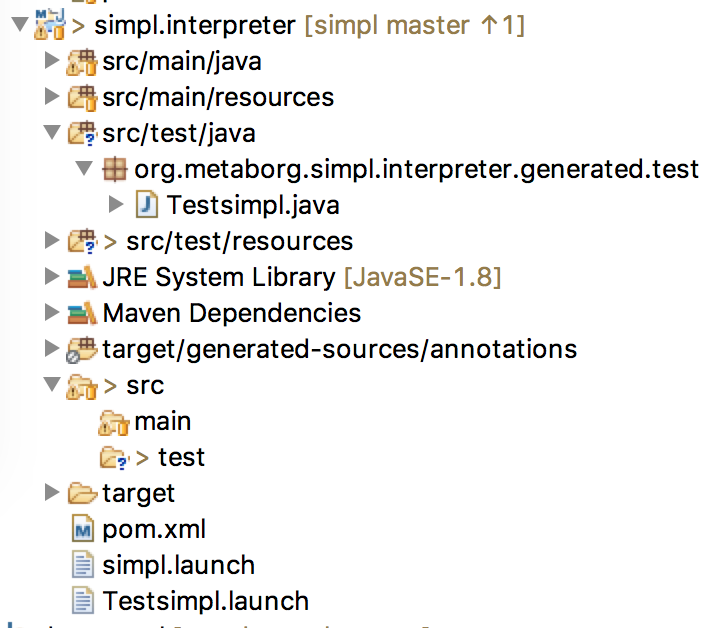
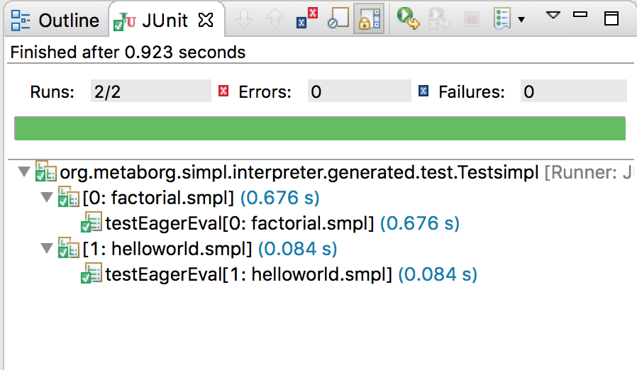

================================
Testing & continuous integration
================================

You have a Spoofax language which has a dynamic semantics in DynSem and you want to automate building and testing of the derived interpreter. This guide will take you through the necessary steps.

~~~~~~~~~~~~~~~~~~~~~~~~~~~~~~~~~~
Enable JUnit test suite generation
~~~~~~~~~~~~~~~~~~~~~~~~~~~~~~~~~~

.. role:: jprop(code)
   :language: jproperties

.. role:: bash(code)
  :language: bash

DynSem can automatically generate a JUnit test harness which automatically runs all your tests. To enable generation you need to add a few extra properties in ``dynsem.properties``:

.. code-block:: jproperties
  :linenos:

  # associated file extensions (comma-separated)
  source.extensions = smpl
  # (optional) Enable generation of a JUnit test suite
  project.generatejunit = true
  # (optional) Specify path to deposit the JUnit test suite into
  project.testjavapath = src/test/java
  # (optional) Specify the path to the test files
  project.testspath = src/test/resources

Line 2 specifies the file extensions for the language. *SIMPL* only allows *smpl*. Your language can support multiple by giving a comma-separated list.

Line 4 enables automatic generation of the JUnit Test Suite. The package in which the test suite will be placed depends on the other properties in the configuration file. It is a concatenation of properties: **[project.groupid].[project.artifactid].generated.test**. For *SIMPL* the fully qualified name of the generated JUnit Suite will be **org.metaborg.simpl.interpreter.generated.test**.

Line 6 specifies the directory in which the JUnit test suite will be placed. The directory structure corresponding to the package will automatically be created. If the property is not given the default is :jprop:`project.testjavapath = src/test/java`.

Line 8 specifies the directory in which the test programs reside. If the property is not given the default is :jprop:`project.testspath = src/test/resources`.

With the above additions the ``dynsem.properties`` file becomes:

.. code-block:: jproperties
  :linenos:
  :emphasize-lines: 5-6, 31-36

  # the name of the language. may not contain hyphens
  source.langname = simpl
  # version of this language
  source.version = 0.1
  # associated file extensions (comma-separated)
  source.extensions = smpl

  # start symbol to use for parsing programs in this language
  source.startsymbol = Prog

  # constructor name/arity of reduction entry point
  source.initconstructor.name = Program
  source.initconstructor.arity = 1

  # path to interpreter project, absolute or relative to the language project
  project.path = ../simpl.interpreter/

  # (optional) enable/disable creation of the target project
  project.create = true

  # (optional) enable/disable cleaning of the target project before writing files
  project.clean = true

  # groupid & artifactid for the interpreter project
  project.groupid = org.metaborg
  project.artifactid = simpl.interpreter

  # package name for manually implemented interpreter nodes
  project.nativepackage = simpl.interpreter.natives

  # (optional) Enable generation of a JUnit test suite
  project.generatejunit = true
  # (optional) Specify path to deposit the JUnit test suite into
  project.testjavapath = src/test/java
  # (optional) Specify the path to the test files
  project.testspath = src/test/resources

.. |Generate| raw:: html

      Spoofax -> Semantics -> Generate Interpreter

We regenerate the interpreter project by invoking |Generate|. The *SIMPL* interpreter the project structure now is:

Note the generation of the **Testsimpl** Java class and the **Testsimpl.launch**. The latter is an Eclipse launch configuration for the test suite. We could already run the test suite but without any tests it would instantaneously succeed.

~~~~~~~~~~~~~~~~~~~~
Create test programs
~~~~~~~~~~~~~~~~~~~~

To create tests we create a 3-tuple for every program consisting of:

1. the program file
2. (optional) the input to the program
3. the expected output of the program

As an example consider the following program in *SIMPL*:

.. code-block:: none

  "hello world"

We save this program in a file named **helloworld.smpl** and place it in the tests directory. From the semantics of *SIMPL* expect this program to evaluate to ``StringV(hello world)`` so we create the expected output file:

.. code-block:: none

  StringV(hello world)

We name it **helloworld.output** (note the ``.output`` file extension) and save it next to the program file - **helloworld.smpl**.

We similarly add a test program which calculates the factorial of 7:

.. code-block:: none

  let
    recf = box(-1)
  in {
    let
      f = box(
        n ->
          ifz(n)
          then 1
          else {
            let
              newn = n - 1
            in
              (n * unbox(recf)(newn))
          }
        )
    in {
      setbox(recf, unbox(f))
      ;unbox(f)(7)
    }
  }

And its expected output:

.. code-block:: none

  NumV(5040)

We save these files as **factorial.smpl** and **factorial.output**.

If your programs consumes user input you can create a ``.input`` file containing the input to be served to the program.

~~~~~~~~~~~~~~~~~~~~
Run tests
~~~~~~~~~~~~~~~~~~~~

.. |Run Configurations| raw:: html

    Run -> Run Configurations...

.. |JUnit| raw:: html

    JUnit

.. |Run| raw:: html

        Run

We can now run the *SIMPL* tests. In Eclipse, select |Run Configurations|, select |JUnit| in the left hand side pane and select the *Testsimpl* launch configuration. Press |Run|. The JUnit view opens and we can observe the test results:

.. role

Tests can also be run from CLI using Maven. To do this, open a console and change into the interpreter project - **simpl.interpreter**. At the prompt run :code:`mvn test`:

.. code-block:: none

  ...
  [INFO] --- maven-surefire-plugin:2.19.1:test (default-test) @ simpl.interpreter ---

  -------------------------------------------------------
   T E S T S
  -------------------------------------------------------
  Running org.metaborg.simpl.interpreter.generated.test.Testsimpl
  Tests run: 2, Failures: 0, Errors: 0, Skipped: 0, Time elapsed: 1.278 sec - in org.metaborg.simpl.interpreter.generated.test.Testsimpl

  Results :

  Tests run: 2, Failures: 0, Errors: 0, Skipped: 0

  [INFO] ------------------------------------------------------------------------
  [INFO] BUILD SUCCESS
  [INFO] ------------------------------------------------------------------------

~~~~~~~~~~~~~~~~~~~~~~~~~~~~
Build your language from CLI
~~~~~~~~~~~~~~~~~~~~~~~~~~~~

We now have a language project and an interpreter project for *SIMPL*. We can run tests from CLI. But we cannot yet generate an interpreter from CLI. To achieve this we need to modify the language project build configuration.

We contribute the following goal to the **pom.xml** file of the *SIMPL* language:

.. code-block:: xml
  :linenos:
  :emphasize-lines: 23

  <build>
    <plugins>
      <plugin>
        <groupId>org.metaborg</groupId>
        <artifactId>spoofax-maven-plugin</artifactId>
        <version>${metaborg-version}</version>
        <extensions>true</extensions>
        <executions>
          <execution>
            <phase>verify</phase>
            <goals>
              <goal>transform</goal>
            </goals>
          </execution>
        </executions>
        <configuration>
          <language>ds</language>
          <goal>Generate Interpreter</goal>
          <fileSets>
            <fileSet>
              <directory>${basedir}/trans</directory>
              <includes>
                <include>simpl.ds</include>
              </includes>
            </fileSet>
          </fileSets>
        </configuration>
      </plugin>
    </plugins>
  </build>
  <dependencies>
    <dependency>
      <groupId>org.metaborg</groupId>
      <artifactId>org.metaborg.meta.lang.esv</artifactId>
      <type>spoofax-language</type>
      <version>${metaborg-version}</version>
    </dependency>
    <dependency>
      <groupId>org.metaborg</groupId>
      <artifactId>org.metaborg.meta.lang.template</artifactId>
      <type>spoofax-language</type>
      <version>${metaborg-version}</version>
    </dependency>
    <dependency>
      <groupId>org.metaborg</groupId>
      <artifactId>meta.lib.spoofax</artifactId>
      <type>spoofax-language</type>
      <version>${metaborg-version}</version>
    </dependency>
    <dependency>
      <groupId>org.metaborg</groupId>
      <artifactId>org.metaborg.meta.lib.analysis</artifactId>
      <type>spoofax-language</type>
      <version>${metaborg-version}</version>
    </dependency>
    <dependency>
      <groupId>org.metaborg</groupId>
      <artifactId>dynsem</artifactId>
      <type>spoofax-language</type>
      <version>${metaborg-version}</version>
    </dependency>
  </dependencies>

Line 23 is the only *SIMPL*-specific entry, it needs to point to the main DynSem file of the language. By convention this must always be **LANGNAME.ds**. This addition instructs Maven to run the *Generate Interpreter* transformation on **simpl.ds** during the ``verify`` phase of the build.

After this addition, issuing :bash:`mvn verify` in the *SIMPL* language project causes the interpreter project to be generated after the language is built. We can run now the *SIMPL* interpretation tests by issuing :bash:`mvn test` in the *SIMPL* interpreter project.

At this stage the language project can be built and the interpreter can be generated and tested, all from the command line using Maven.

~~~~~~~~~~~~~~~~~~~~~~~~~~~~~~~~~~~~~
Continuous integration with Travis CI
~~~~~~~~~~~~~~~~~~~~~~~~~~~~~~~~~~~~~
