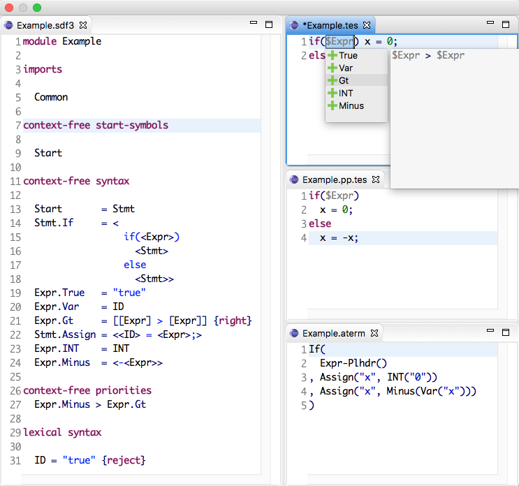
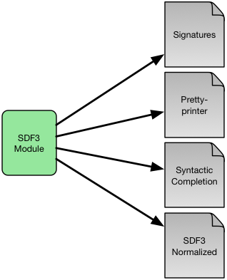

==================
SDF3 Overview
==================

The SDF family of Syntax Definition Formalisms provides support for declarative
definition of the syntax of programming languages and domain-specific languages.
The key principle underlying the design of SDF is declarative syntax definition,
so that the user does not need to understand underlying parsing algorithm.

SDF has evolved into SDF3 to serve the needs of modern language workbenches and
at the same time improve various issues of its predecessor, SDF2. With SDF3, it is
possible to modularly describe a language's syntax, generating a parser, a pretty
printer, and basic editor features such as syntactic code completion and syntax
highlighting. SDF3 also supports safe operator precedence and associativity
disambiguation by means of priority declarations, and lexical ambiguities by means
of reject rules and follow restrictions.

The screenshot below from Spoofax illustrates an excerpt of a grammar written
in SDF3, a program of that language being edited, its pretty-printed
version and its abstract syntax tree.

To list the main improvements of SDF3 with respect to SDF2:

  - SDF3 incorporates constructors into the syntax definition, providing a direct correspondence between abstract syntax trees and grammar rules.

  - Grammar rules follow the productive form, improving readability and consistency with main-stream grammar formalisms.

  - Grammar rules can be used next to template productions, which considers the whitespace surrounding symbols when deriving a pretty-printer.

  - Finally, grammar rules can be identified by its sort and constructor, and do not need to be duplicated in the priorities section.

SDF3 is in constant evolution, and this documentation provides an up-to-date
overview of its current features.

.. This is the SDF3 reference manual. It is partially based on the `SDF2
.. documentation <https://homepages.cwi.nl/~daybuild/daily-books/syntax/2-sdf/sdf.html>`__
.. by Mark van den Brand, Paul Klint, and Jurgen Vinju.

Even though the primary goal of SDF3 is syntax definition, it is used as input
to generate many artifacts that are used in Spoofax. The figure below illustrates
the artifacts produced when compiling an SDF3 module.

The most important of the artifacts generated from SDF3 is a parse table,
which is used by the Scannerless Generalized LR parser to parse programs,
producing an abstract syntax tree (AST). Note that SGLR supports ambiguous
grammars, outputing a parse forest as result. SDF3 disambiguation mechanisms
operate at parse table generation time, at parse time, and after parsing. Ideally,
a single tree is produced at the end. The whole process of parsing a source program
is described in the figure below.

.. figure:: images/parsing.png
   :align: center

In the remainder of this documentation we present the elements of an SDF3
definition.

