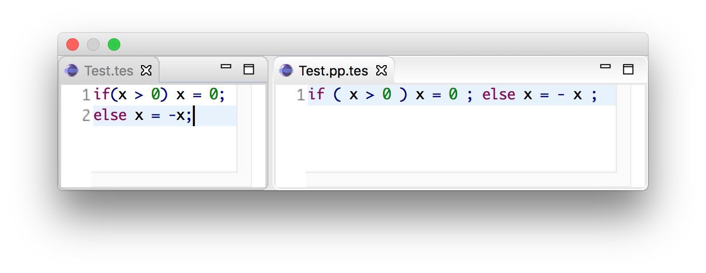

.. highlight:: sdf3

.. _sdf3-reference:

===========================
SDF3 Reference Manual
===========================

Modules
~~~~~~~

An SDF3 specification consists of a number of module declarations. Each
module may import other modules and define sections that include sort, start
symbols, syntax, restrictions, priorities, and template options.

Imports
^^^^^^^

Modules may import other modules for reuse or separation of concerns. A
module may extend the definition of a non-terminal in another module. A
module may compose the definition of a language by importing the parts
of the language. The structure of a module is as follows:

::

    module <ModuleName>

    <ImportSection>*

    <Section>*

The ``module`` keyword is followed by the module name, then a series of
imports can be made, followed by sections that contain the actual
definition of the syntax. An import section is structured as follows:

::

    imports <ModuleName>*

Note that SDF3 does not support parameterized modules.

Symbols
~~~~~~~

The building block of SDF3 productions is a symbol. SDF3 symbols can
be compared to terminals and non-terminals in other grammar formalisms. The
elementary symbols are literals, sorts and character classes.

Intrinsically, only character classes are real terminal symbols. All other symbols
represent non-terminals. SDF3 also support symbols that capture BNF-like notation
such as lists and optionals. Note that these symbols are also non-terminals, and
are just shorthands for common structures present in context-free grammars.

Character classes
^^^^^^^^^^^^^^^^^

Character classes occur only in lexical syntax and are enclosed by ``[`` and ``]``.
A character class consists of a list of zero or more characters (which stand for
themselves) such as ``[x]`` to represent the character ``x``,  or character ranges,
as an abbreviation for all the characters in the range such as ``[0-9]`` representing
``0``, ``1``, ..., ``9``. A valid range consists of ``[c1-c2]``, where the character
``c2`` has a higher ASCII code than ``c1``. Note that nested character classes can also
be concatenated within the same character class symbol, for example ``[c1c2-c3c4-c5]``
includes the characters ``c1`` and the ranges ``c2-c3``, ``c4-c5``. In this case,
the nested character classes do not need to be ordered, as SDF3 orders them when
performing a normalization step.

**Escaped Characters**: SDF3 uses a backslash (``\``) as a escape for the quoting
of special characters. One should use ``\c`` whenever ``c`` is not a digit or a letter
in a character class.

Additionally, special ASCII characters are represented by:

- ``\n`` : newline character
- ``\r`` : carriage return
- ``\t`` : horizontal tabulation
- ``\x`` : a non-printable character with decimal code x

**Character Class Operators**: SDF3 provides the following operators for character
classes:

- (complement) ``~`` : Accepts all the characters that are *not* in the original class.
- (difference) ``/`` : Accepts all the characters in the first class unless they are in a second class.
- (union) ``\/`` : Accepts all the characters in either character classes.
- (intersection) ``/\`` : Accepts all the characters that are accepted by both character classes.

Note that the first operator is unary and the other ones are left associative binary
operators. Furthermore, such operators are not applicable to other symbols in general.

Literals
^^^^^^^^

A literal symbol defines a fixed length word. This usually corresponds to a
terminal symbol in ordinary context-free grammars, for example ``"true"`` or
``"+"``. Literals must always be quoted and consist of (possibly escaped)
ASCII characters.

As literals are also regular non-terminals, SDF3 automatically generates productions
for them in terms of terminal symbols.

::

     "definition" = [d][e][f][i][n][i][t][i][o][n]

Note that the production above defines a case-sensitive implementation of the
defined literal. Case-insensitive literals are defined using single-quoted strings
as in ``'true'`` or ``'else'``. SDF3 generates a different production for
case-insensitive literals as

::

     'definition' = [dD][eE][fF][iI][nN][iI][tT][iI][oO][nN]

The literal above accepts case-insensitive inputs such as
``definition``, ``DEFINITION``, ``DeFiNiTiOn`` or ``defINITION``.

Sorts
^^^^^

A sort correspond to a plain non-terminal, for example, ``Statement`` or ``Exp``.
Sort names start with a capital letter and may be follow by letters, digits or
hyphen. Note that unlike SDF2, SDF3 does not support parameterized sorts (yet!).

Optionals
^^^^^^^^^

SDF3 provides a shorthand for describing zero or exactly one occurrence of a sort
by appending the sort with ``?``. For example, the sort ``Extends?`` can be parsed
as ``Extends`` or without consuming any input. Internally, SDF3 generates the
following productions after normalizing the grammar

::

     Extends?.None =
     Extends?.Some = Extends

Note that using ``?`` adds the constructors ``None`` and ``Some`` to the final
abstract syntax tree.

Lists
^^^^^

Lists symbols as the name says, indicate that a symbol should occur several times.
In this way, it is also possible to construct flat structures to represent them.
SDF3 provides support for two types of lists, with and without separators.
Furthermore, it is also possible to indicate whether a list can be empty (``*``) or
should have at least one element (``+``). For example, a list ``Statement*`` indicates
zero or more ``Statement``, whereas a list with separator ``{ID ","}+`` indicates one
or more ``ID`` separated by ``,``. Note that SDF3 only supports literal symbols as
separators.

Again, SDF3 generates the following productions to represent lists, when normalizing
the grammar

::

     Statement* =
     Statement* = Statement+
     Statement+ = Statement+ Statement
     Statement+ = Statement

     {ID ","}* =
     {ID ","}* = {ID ","}+
     {ID ","}+ = {ID ","}+ "," {ID ","}
     {ID ","}+ = {ID ","}

When parsing a context-free list, SDF3 produces a flattened list as an AST node such as
``[Statement, ..., Statement]`` or ``[ID, ..., ID]``. Note that because the separator
is a literal, it does not appear in the AST.

Alternative
^^^^^^^^^^^

Alternative symbols express the choice between two symbols, for example, ``ID | INT``. That is,
the symbol ``ID | INT`` can be parsed as either ``ID`` or ``INT``. For that reason,
SDF3 normalizes alternatives by generating the following productions:

::

     ID | INT = ID
     ID | INT = INT

Note that SDF3 only allow alternative symbols to occur in lexical syntax. Furthermore,
note that the alternative operator is right associative and binds stronger than any operator.
That is, ``ID "," | ID ";"`` expresses ``ID ("," | ID) ";"``. To express
``(ID ",") | (ID ";")``, we can use a sequence symbol.

Sequence
^^^^^^^^

A sequence operator allows grouping of two or more symbols. Sequences are useful
when combined with other symbols such, lists or optionals, for example ``("e" [0-9]+)?``.
Like alternative symbols, sequences can only occur in lexical syntax. A sequence
symbol is normalized as:

::

     ("e" [0-9]+) = "e" [0-9]+

Labeled symbols
^^^^^^^^^^^^^^^

SDF3 supports decorating symbols with labels, such as ``myList:{elem:Stmt ";"}*``.
The labels have no semantics but can be used by other tools that use SDF3 grammars
as input.

``LAYOUT``
^^^^^^^^^^

The ``LAYOUT`` symbol is a reserved sort name. It is used to indicate the whitespace
that can appear in between context-free symbols. The user must define the symbol
``LAYOUT`` such as:

::

     LAYOUT = [\ \t\n]

Note that the production above should be defined in the lexical syntax.

Syntax
~~~~~~

As seen before, a SDF3 module may constitute of zero or more sections. All sections
contribute to the final grammar that defines a language. Sections can define
production rules, priorities, restrictions, or simply specify some characteristics
of the syntax definition.

Sort declarations
^^^^^^^^^^^^^^^^^

Sorts are declared by listing their name in a sorts section which has
the following form:

::

    sorts

      <Sort>*

Writing a sort in this section only indicates that a sort has been defined, even if
it does not have any explicit production visible.

Start symbols
^^^^^^^^^^^^^

The lexical or context-free start symbols sections explicitly define the
symbols which will serve as start symbols when parsing terms. If no
start symbols are defined it is not possible to recognize terms. This
has the effect that input sentences corresponding to these symbols can
be parsed. So, if we want to recognize boolean terms we have to define
explicitly the sort ``Boolean`` as a start symbol in the module
``Booleans``. Any symbol and also lists, optionals, etc., can serve as a
start-symbol. A definition of lexical start symbols looks like

::

    lexical start-symbols

      <Symbol>*

while context-free start symbols are defined as

::

    context-free start-symbols

      <Symbol>*

SDF3 also supports kernel start-symbols

::

    start-symbols

      <Symbol>*

In contrast to lexical and kernel start-symbols, context-free start symbols can be
surrounded by optional layout. A lexical start-symbol should have been defined
by a production in the lexical syntax; a context-free symbol should have been
defined in the context-free syntax. Both symbols can also be defined in kernel syntax
using the prefix ``-LEX`` or ``-CF``.

Lexical syntax
^^^^^^^^^^^^^^

The lexical syntax usually describes the low level structure of programs
(often referred to as lexical tokens.) However, in SDF3 the token
concept is not really relevant, since only character classes are
terminals. The lexical syntax sections in SDF3 are simply a convenient
notation for the low level syntax of a language. The ``LAYOUT`` symbol
should also be defined in a lexical syntax section. A lexical syntax
consists of a list of productions.

Lexical syntax is described as follows:

::

    lexical syntax

      <Production>*

An example of a production in lexical syntax:

::

    lexical syntax

      BinaryConst = [0-1]+

Context-free syntax
^^^^^^^^^^^^^^^^^^^

The context-free syntax describes the more high-level syntactic
structure of sentences in a language. A context-free syntax contains a
list of productions. Elements of the right-hand side of a context-free
production are pre-processed in a normalization step before parser generation
that adds the ``LAYOUT?`` symbol between any two symbols. Context-free syntax
has the form:

::

    context-free syntax

      <Production>*

An example production rule:

::

    context-free syntax

      Block.Block = "{" Statement* "}"

SDF3 automatically allows for layout to be present between the symbols
of a rule. This means that a fragment such as:

::

    {

    }

will still be recognized as a block (assuming that the newline and
line-feed characters are defined as layout).

Kernel syntax
^^^^^^^^^^^^^

The rules from context-free and lexical syntax are translated into kernel syntax
by the SDF3 normalizer. When writing kernel syntax, one has more control over the
layout between symbols of a production.

As part of normalization, among other things, SDF3 renames each symbol in the
lexical syntax to include the suffix ``-LEX`` and each symbol in the context-free
syntax to include the suffix ``-CF``. For example, the two productions above
written in kernel syntax look like

::

    syntax

      Block-CF.Block  = "{" LAYOUT?-CF Statement*-CF LAYOUT?-CF "}"
      BinaryConst-LEX = [0-1]+

Literals and character-classes are lexical by definition, thus they do not need any
suffix. Note that each symbol in kernel syntax is uniquely identified by its full
name including ``-CF`` and ``-LEX``. That is, two symbols named ``Block-CF`` and
``Block`` are different, if both occur in kernel syntax. However, ``Block-CF`` is
the same symbol as ``Block`` if the latter appears in a context-free syntax section.

As mentioned before, layout can only occur in between symbols if explicitly
specified. For example, the production

::

    syntax

      Block-CF.Block  = "{" Statement*-CF LAYOUT?-CF "}"

does not allow layout to occur in between the opening bracket and the list
of statements. This means that a fragment such as:

::

    {
      x = 1;
    }

would not be recognized as a block.

Productions
^^^^^^^^^^^

The basic building block of syntax sections is the production.
The left-hand side of a regular production rule can
be either just a symbol or a symbol followed by ``.`` and a constructor
name. The right-hand side consists of zero or more symbols. Both sides
are separated by ``=``:

::

    <Symbol>               = <Symbol>*
    <Symbol>.<Constructor> = <Symbol>*

A production is read as the definition. The symbol on the left-hand side
is defined by the right-hand side of the production.

Productions are used to describe lexical as well as context-free syntax.
Productions may also occur in priority sections, but might also be referred to
by its ``<Symbol>.<Constructor>``. All productions with the same symbol
together define the alternatives for that symbol.

Attributes
^^^^^^^^^^

The definition of lexical and context-free productions may be followed
by attributes that define additional (syntactic or semantic) properties
of that production. The attributes are written between curly brackets
after the right-hand side of a production. If a production has more than
one attribute they are separated by commas. Attributes have thus the
following form:

::

    <Sort>               = <Symbol>* { <Attribute1>, <Attribute2>, ...}
    <Sort>.<Constructor> = <Symbol>* { <Attribute1>, <Attribute2>, ...}

The following syntax-related attributes exist:

-  ``bracket`` is an important attribute in combination with priorities.
   For example, the *sdf2parenthesize* tool uses the ``bracket``
   attribute to find productions to add to a parse tree before pretty
   printing (when the tree violates priority constraints). Note that
   most of these tools demand the production with a ``bracket``
   attribute to have the shape: ``X = "(" X ")" {bracket}`` with any
   kind of bracket syntax but the ``X`` being the same symbol on the
   left-hand side and the right-hand side. The connection with
   priorities and associativity is that when a non-terminal is
   disambiguated using either of them, a production rule with the
   ``bracket`` attribute is probably also needed.
-  ``left``, ``right``, ``non-assoc``, ``assoc`` are disambiguation
   constructs used to define the associativity of productions. See
   associativity_.
-  ``prefer`` and ``avoid`` are disambiguation constructs to define
   preference of one derivation over others. See preferences_.
-  ``reject`` is a disambiguation construct that implements language
   difference. It is used for keyword reservation. See rejections_.

.. TODO: Talk about layout-sensitive parsing and layout sensitive attributes

Templates
~~~~~~~~~

Templates are a major change in SDF3 when comparing to SDF2. They are essential
when aiming to generate a nice pretty printer or generate proper syntactic code
completion templates. When generating such artifacts, a general production simply
introduces a whitespace in between symbols.

For example, when writing a grammar rule

::

    Statement.If = "if" "(" Exp ")" Exp "else" Exp

and pretty printing a valid program, we would get the text in a single line
separated by spaces, as:

Furthermore, code completion would consider the same indentation when inserting
code snippets.

However, when using template productions such as

::

    Statement.If = <
      if (<Exp>)
        <Exp>
      else
        <Exp>>

We would get the following program.

.. figure:: images/pp-template.png
   :align: center

Again, code completion would also consider this indentation for proposals.

That is, in template productions, the surrounding layout is used to nicely pretty
print programs and its code completion suggestions.

Template Productions
^^^^^^^^^^^^^^^^^^^^

Template productions are an alternative way of defining productions.
Similarly, they consist of a left-hand side and a right-hand side
separated by ``=``. The left-hand side is the same as for productive
rules. The right-hand side is a template delimited by ``<`` and ``>``.
The template can contain zero or more symbols::

    <Sort>               = < <Symbol>* >
    <Sort>.<Constructor> = < <Symbol>* >

Alternatively, square brackets can be used to delimit a template::

    <Sort>               = [ <Symbol>* ]
    <Sort>.<Constructor> = [ <Symbol>* ]

The symbols in a template can either be placeholders or literal strings.
It is worth noting that:

-  placeholders need to be enclosed within the same delimiters (either
   ``<...>`` or ``[...]``) as the template ;
-  literal strings need not not be enclosed within quotation marks;
-  literal strings are tokenized on space characters (whitespace, tab);
-  additionally, literal strings are tokenized on boundaries between
   characters from the set given by the tokenize option, see the
   tokenize template option;
-  placeholders translate literally. If a separator containing any
   layout characters is given, the placeholder maps to a list with
   separator that strips the layout.

An example of a template rule::

    Exp.Addition = < <Exp> + <Exp> >

Here, the ``+`` symbol is a literal string and ``<Exp>`` is a
placeholder for sort ``Exp``.

Placeholders are of the form:

-  ``<Sort?>``: optional placeholder
-  ``<Sort*>``: repetition (0...n)
-  ``<Sort+>``: repetition (1...n)
-  ``<{Sort ","}*>``: repetition with separator

.. TODO Explain why one should use template productions.

Case-insensitive Literals
^^^^^^^^^^^^^^^^^^^^^^^^^

As we showed before, SDF3 allows defining case-insensitive literals as
single-quoted strings in regular productions. For example::

     Exp.If = 'if' "(" Exp ")" Exp 'else' Exp

accepts case-insensitive keywords for ``if`` and ``else`` such as
``if``, ``IF``, ``If``, ``else``, ``ELSE`` or ``ELsE``. However, to
generate case-insensitive literals from template productions, it is
necessary to add annotate these productions as case-insensitive. For
example, a template production::

     Exp.If = <
        if(<Exp>)
          <Exp>
        else
          <Exp>
     > {case-insensitive}

accepts the same input as the regular production mentioned before.

Moreover, lexical symbols can also be annotated as case-insensitive to parse as
such. The constructed abstract syntax tree contains lower-case symbols, but the
original term is preserved via origin-tracking. For example::

    ID = [a-zA-z][a-zA-Z0-9]* {case-insensitive}

can parse ``foo``, ``Foo``, ``FOo``, ``fOo``, ``foO``, ``fOO`` or
``FOO``. Whichever option generates a node ``"foo"`` in the abstract
syntax tree. By consulting the origin information on this node, it is
possible to know which term was used as input to the parser.

Template options
^^^^^^^^^^^^^^^^

Template options are options that are applied to the current file. A
template options section is structured as follows::

    template options

      <TemplateOption*>

Multiple template option sections are not supported. If multiple
template option sections are specified, the last one is used.

There are three kinds of template options.

**keyword**
  Convenient way for setting up lexical follow restrictions for keywords. See the section on follow restrictions for more information. The
  structure of the keyword option is as follows:

  ::

      keyword -/- <Pattern>

  This will add a follow restriction on the pattern for each keyword in
  the language. Keywords are automatically detected, any terminal that
  ends with an alphanumeric character is considered a keyword.

  Multiple keyword options are not supported. If multiple keyword options
  are specified, the last one is used.

  Note that this only sets up follow restrictions, rejection of keywords
  as identifiers still needs to be written manually.

**tokenize**
  Specifies which characters may have layout around them. The structure of a tokenize option is as follows:

  ::

      tokenize : "<Character*>"

  Consider the following grammar specification:

  ::

      template options

        tokenize : "("

      context-free syntax

        Exp.Call = <<ID>();>

  Because layout is allowed around the ``(`` and ``)`` characters, there
  may be layout between ``()`` and ``;`` in the template rule. If no
  tokenize option is specified, it defaults to the default value of
  ``()``.

  Multiple tokenize options are not supported. If multiple tokenize
  options are specified, the last one is used.

**reject**
  Convenient way for setting up reject rules for keywords. See the section
  on rejections_ for more information. The structure of the reject option
  is as follows:

  ::

      Symbol = keyword {attrs}

  where ``Symbol`` is the symbol to generate the rules for. Note that
  ``attrs`` can be include any attribute, but by using ``reject``, reject
  rules such as ``ID = "true" {reject}`` are generated for all keywords
  that appear in the templates.

  Multiple reject template options are not supported. If multiple reject
  template options are specified, the last one is used.

Disambiguation
~~~~~~~~~~~~~~

As we showed before, the semantics of SDF3 can be seen as two-staged.
First, the grammar generates all possible derivations. Second, the disambiguation
constructs remove a number of derivations that are not valid. Note that SDF3
actually performs some disambiguation when generating the parse table or during
parsing.

Rejections
^^^^^^^^^^

Rejections filter derivations. The semantics of a rejection is that the
set of valid derivations for the left-hand side of the production will
not contain the construction described on the right-hand side. In other
words, the language defined by the sort on the left-hand side has become
smaller, removing all the constructions generated by the rule on the
right-hand side. Disambiguation by ``reject`` occurs at parse time (mostly).

A rule can be marked as rejected by using the attribute ``{reject}``
after the rule:

::

    <Sort> = ... {reject}

The ``{reject}`` attribute works well for lexical rejections, especially
keyword reservation in the form of productions like :

::

    ID = "keyword" {reject}

Preferences
^^^^^^^^^^^

The preferences mechanism is another disambiguation filter that provides
a post parse filter to parse forests. The attributes ``prefer``
and ``avoid`` are the only disambiguation constructs that compare
alternative derivations after parsing.

The following definition assumes that derivations are represented using
parse forests with "packaged ambiguity nodes". This means that whenever
in a derivation there is a choice for several sub-derivations, at that
point a special choice node (ambiguity constructor) is placed with all
alternatives as children. We assume here that the ambiguity constructor
is always placed at the location where a choice is needed, and not
higher (i.e. a minimal parse forest representation). The preference
mechanism compares the top nodes of each alternative:

-  All alternative derivations that have ``avoid`` at the top node will
   be removed, but only if other alternatives derivations are there that
   do not have ``avoid`` at the top node.
-  If there are derivations that have ``prefer`` at the top node, all
   other derivations that do not have ``prefer`` at the top node will be
   removed.

The preference attribute can be used to handle the case when two productions
can parse the same input. Here is an example:

::

    Exp.FunctionApp = <<Expr> <Expr*>>
    Exp.Constructor = <<ID> <Expr>>  {prefer}

Priorities
^^^^^^^^^^

Priorities are one of SDF3's most often used disambiguation constructs.
A priority section defines the relative priorities between
productions. Priorities are a powerful disambiguation construct because
it occurs at parse generation time. The idea behind the semantics of priorities
is that productions with a higher priority "bind stronger" than productions with
a lower priority. The essence of the priority disambiguation construct is
that certain parse trees are removed from the ‘forest’ (the set of all possible
parse trees that can be derived from a segment of code). The basic priority
syntax looks like this:

::

    context-free priorities

      <ProductionRef> >  <ProductionRef>

Where ``<ProductionRef>`` can either be ``<Sort>.<Cons>`` or the entire
production itself.

Several priorities in a priority grammar are separated by commas. If
more productions have the same priority they may be grouped between
curly braces on each side of the > sign.

::

    context-free priorities

      {<ProductionRef> <ProductionRef>}
                    >  <ProductionRef>,
       <ProductionRef>
                    >  <ProductionRef>

By default, the priority relation is automatically transitively closed
(i.e. if A > B and B > C then A > C). To specify a non-transitive priority
relation it is necessary to include a dot before the > sign (``.>``).

SDF3 provides *safe* disambiguation, meaning that priority relations only remove
ambiguous derivations. Furthermore, SDF3 also allows tree filtering by means
of indexed priorities such as:

::

    context-free priorities

      <ProductionRef> <idx> >  <ProductionRef>

where the symbol at position ``idx`` (starting with 0) in the first production
should not derive the second production.

An example defining priorities for the addition, subtraction and
multiplication operators is listed below. Because addition and
subtraction have the same priority, the are grouped together between
brackets.

::

    context-free priorities

      {Exp.Times} >
      {Exp.Plus Exp.Minus}

Associativity
^^^^^^^^^^^^^

Like with priorities, the essence of the associativity attribute is that
certain parse trees are removed from the ‘forest’.

-  The ``left`` associativity attribute on a production P filters all
   occurrences of P as a direct child of P in the right-most argument.
   This implies that ``left`` is only effective on productions that are
   recursive on the right (as in ``A B C -> C``).
-  The ``right`` associativity attribute on a production P filters all
   occurrences of P as a direct child of P in the left-most argument.
   This implies that ``right`` is only effective on productions that are
   recursive on the left ( as in ``C A B -> C``).
-  The ``non-assoc`` associativity attribute on a production P filters
   all occurrences of P as a direct child of P in any argument. This
   implement that ``non-assoc`` is only effective if a production is
   indeed recursive (as in ``A C B -> C``).
-  The ``assoc`` attribute means the same as ``left``

Associativity declarations occur in two places in SDF3. The first is as
production attributes. The second is as associativity declarations in
priority groups.

An example on how to mention associativity as a production attribute is
given below:

::

    Exp.Plus = <<Exp> + <Exp>> {left}

In priority groups, the associativity has the same semantics as the
associativity attributes, except that the filter refers to more nested
productions instead of a recursive nesting of one production. The group
associativity attribute works pairwise and commutative on all
combinations of productions in the group. If there is only one element
in the group the attribute is reflexive, otherwise it is not reflexive.

::

    context-free priorities

      {left: Exp.Times} >
      {left: Exp.Plus Exp.Minus}

Restrictions
^^^^^^^^^^^^

The notion of restrictions enables the formulation of lexical
disambiguation strategies. Examples are "shift before reduce" and
"longest match". A restriction filters applications of productions for
certain non-terminals if the following character (lookahead) is in a
certain class. The result is that specific symbols may not be followed
by a character from a given character class. A lookahead may consist of
more than one character class (multiple lookahead). Restrictions come in
two flavors:

-  lexical restrictions that apply to lexical non-terminals
-  context-free restrictions that apply to context-free non-terminals.

The general form of a restriction is:

::

    <Symbol>+ -/- <Lookaheads>

The semantics of a restriction is to remove all derivations that produce
a certain ``<Symbol>``. The condition for this removal is that the
derivation tree for that symbol is followed immediately by something
that matches the lookahead declaration. Note that to be able to check
this condition, one must look past derivations that produce the empty
language, until the characters to the right of the filtered symbol are
found. Also, for finding multiple lookahead matches, one must ignore
nullable sub-trees that may occur in the middle of the matched
lookahead.

In case of lexical restrictions ``<Symbol>`` may be either a literal or
sort. In case of context-free restrictions only a sort or symbol is
allowed. The restriction operator ``-/-`` should be read as may not be
followed by. Before the restriction operator ``-/-`` a list of symbols
is given for which the restriction holds.

As an example, the following restriction rule implements the “longest
match” policy: an identifier can not be followed by an alpha-numeric
character.

::

    ID -/- [a-zA-Z0-9\_]

.. _layout-declarations:

Layout-sensitive parsing
^^^^^^^^^^^^^^^^^^^^^^^^^^^^^^^^^^^

SDF3 supports definition of layout sensitive syntax by means of layout constraints.
While we haven't covered this feature in this documentation, the paper :cite:`s-ErdwegRKO12` describes the concepts.

**Layout Declarations**

In the paper :cite:`s-ErdwegRKO12`, the authors describe layout constraints in terms of restrictions involving
the position of the subtree involved in the constraint (``0``, ``1``, ...), token selectors (``first``, ``left``, ``last`` and ``right``), and position selectors as lines and columns (``line`` and ``col``).
This mechanism allows writing layout constraints to express alignment, offside and indentation rules, but writing such constraints is
rather cumbersome and error prone. Alternatively, one may write layout constraints using **layout declarations**, which are more declarative specifications and abstract over
lines, columns and token selectors as the original layout constraints from :cite:`s-ErdwegRKO12`.

- **tree selectors**

To specify which trees should be subject to a layout constraint, one may use: tree positions, SDF3 labeled non-terminals, or unique literals that occurs
in the production. For example:

::

    context-free syntax

      Stmt.IfElse = "if" Exp "then" Stmts "else" else:Stmts  {layout(
         indent "if" 3, else &&
         align 3 else &&
         align "if" "else"
      )}

In the layout constraint for the production above, ``else`` refers to the tree for the labeled non-terminal ``else:Stmts``, ``"if"`` refers to the tree
corresponding to the ``"if"`` literal and the number 3 correspond to the tree at *position 3* in the parse tree (starting at 0, ignoring trees for ``LAYOUT?``).

- **align**

The layout constraint ``layout(align x y1, ..., yn)`` specifies that the trees indicated by the tree selectors
``yi`` should be aligned with the tree indicated by the tree selector ``x``, i.e., all these trees should start in the same column. For example,
if we consider the production above, the following program is correct according to the **align** constraints:

.. code:: python

    if x < 0 then
    ··x = 0
    else
    ··y = 1

Whereas, the following program is incorrect because neither the if and else keyword align (``align "if" "else"``),
nor the statements in the branches (``align 3 else``):

.. code:: python

    if x < 0 then
    ··x = 0
    ·else
    ···y = 1

- **align-list**

The constraint **align-list** can be used to indicate that all subtrees within a list should be aligned. That is, a constraint ``layout(align-list x)``,
where ``x`` is a tree selector for a list subtree, can be used to enforce such constraint.
For example, consider the following production and its layout constraint:

::

    context-free syntax

      Stmt.If = "if" Exp "then" then:Stmt*  {layout(
         align-list then
      )}

This constraint indicates that statements inside the list should be aligned.
Therefore, the following program is correct according to this constraint:

.. code:: python

    if x < 0 then
    ··x = 0
    ··y = 4
    ··z = 2

And the following program is invalid, as the second statement is misaligned:

.. code:: python

    if x < 0 then
    ··x = 0
    ···y = 4
    ··z = 2

- **offside**

The offside rule is very common in layout-sensitive languages. It states that all lines after the first one should be further to the
right compared to the first line. For a description of how the offside rule can be modelled with layout constraints, refer to :cite:`s-ErdwegRKO12`.
An example of a declarative specification of the offside rule can be seen in the production below:

::

    context-free syntax

      Stmt.Assign = <<ID> = <Exp>> {layout(offside 3)}

The layout constraint specifies that when the expression in the statement spams multiple lines, all following lines should be indented with
respect to the column where the expression started.
For example, the following program is valid according to this constraint:

.. code:: python

    x = 4 * 10
    ·····+ 2

However, the following program is not valid, as the second line of the expression starts at the same column as the first line:

.. code:: python

    x = 4 * 10
    ····+ 2

Note that if the expression is written on a single line, the constraint is also verified. That is, the following program successfully parses:

.. code:: python

    x = 4 * 10 + 2

It is also possible to use the offside relation on different trees. For example, consider the constraint in the following production:

::

    context-free syntax

      Stmt.If = "if" Exp "then" then:Stmt*  {layout(
         offside "if" then
      )}

This constraint states that all lines (except the first) of the statements in the ``then`` branch should be indented with respect to the ``if``
literal. Thus, the following program is invalid according to this layout constraint, because the statement ``x = 2`` should be indented with relation to the topmost ``if``.

.. code:: python

    if x < 0 then
    ··if y < 0 then
    x = 2

In general, an **offside** constraint involving more than a single tree is combined with **indent** constraint to enforce that the column of the first and all subsequent lines should be indented.

- **indent**

An indent constraint indicates that the column of the first line of a certain tree should be further to the right with respect to another tree. For example, consider the following production:

::

    context-free syntax

      Stmt.If = "if" Exp "then" then:Stmt*  {layout(
         indent "if" then
      )}

This constraint indicates that the first line of the list of statements should be indented with respect to the ``if`` literal. Thus, according to this constraint the following program is valid:

.. code:: python

    if x < 0 then
    ··x = 2

Note that if the list of statements in the then branch spams multiple lines, the constraint does not apply to its subsequent lines. For example, consider the following program:

.. code:: python

    if x < 0 then
    ··x = 2 + 10
    * 4
    y = 3

This program is still valid, since the column of the first line of the first assignment is indented with respect to the if literal. To indicate that the first and all subsequent lines should be indented, an offside constraint should also be included.

::

    context-free syntax

      Stmt.If = "if" Exp "then" then:Stmt*  {layout(
         indent "if" then &&
         offside "if" then
      )}

With this constraint, the remainder of the expression ``* 4`` should also be further to the right compared to the "if" literal. The following program is correct according to these two constraints, since the second line of the first assignment and the second assignment are also indented with respect to the ``if`` literal:

.. code:: python

    if x < 0 then
    ··x = 2 + 10
    ·* 4
    ·y = 3

Finally, all these layout declarations can be ignored by the parser and used only when generating the pretty-printer. To do that, prefix the constraint with **pp-** writing, for example, **pp-offside** or **pp-align**.

.. todo:: Part of this documentation is not yet written.
