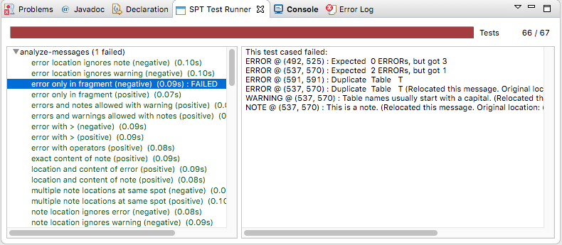

# SPT

The SPoofax Testing language (SPT) allows language developers to test their language in a declarative way.
It offers a language to express test cases for any textual language that you want to test, and a framework for executing those tests on language implementations created with Spoofax.

We will first describe the syntax and semantics of the SPT language.
Then, we will discuss how you can execute your SPT test cases, and finally we conclude with an overview of the architecture of the SPT framework.

## Syntax and Semantics of SPT

In this section we will describe the syntax and semantics of SPT.

If you want to write your own tests you can follow along as the different concepts are explained.
We suggest using the Spoofax Eclipse plugins, as they contain an editor for SPT files.
In an Eclipse with Spoofax installed, simply create a new file with the extension `.spt` and follow along to create your first SPT test suite.

### Test suites

Test cases in SPT are grouped in test suites (or modules).
Each SPT file contains exactly 1 test suite.

Test suites allow you to group together the test cases that test similar aspects of your language, making it easier to organize your tests.
They also allow you to reduce the size of your test cases by using configuration options like *headers* and *test fixtures* that apply to all test cases in the test suite.
We will describe those later on.

The syntax for a test suite is as follows:
```
TestSuite = <
  module <MODULENAME>
  <Header?>
  <TestFixture?>
  <TestCase*>
>
```

The modulename must start with a letter and can be followed by any number of letters, digits, underscores, and dashes.

If you are following along, you can create your first SPT test suite.
Just create a file with the extension `.spt` and paste the following:
```
module my-first-test-suite

language MyLanguageName
```
Be sure to replace `MyLanguageName` with the name of the language you want to test.
Also, feel free to use a more descriptive module name if you like.

### Headers

Headers are a configuration option for all test cases in a test suite.
The most important header is the language header.
If you are following along with the example, you have already used it to specify which language you wanted to test.
All test cases in the test suite will be ran against the language you specify with the language header.
This language will be called the *language under test* (LUT).

```
Header.Language = <language <LANGNAME>>
```

For now, there is only one other header: the start symbol header.
This optional header allows you to specify a nonterminal from your grammar from which the test cases will be parsed.
Don't worry if that doesn't make any sense yet.
We will look at an example later.

```
Header.StartSymbol = <start symbol <ID>>
```

Where the `ID` must start with a letter, and can be followed by any number of letters or digits.

As our example test suite already contains the language header, we will move on to writing our first test.

### Test Cases

Test cases are the most important parts of SPT.
Each test case is a behaviorial test, or black-box test, for your language.
A behavioral test consists of a component that should be tested, an initial state for that component, input for that component, and the expected output after running the component on the input.

First, let's look at the input of a test case.
As we are testing languages, the input of a test case is always a program written in the language under test.
Such a program written in the language under test is called a *fragment*, and it is embedded in the SPT test suite.
In the future, we want to offer all editor services of your language under test (e.g., syntax highlighting) while you are writing such a fragment.
However, for now this is not yet supported.

The component that should be tested and the expected output are captured in *test expectations*.
We will discuss those in a later section.

Finally, the initial state of the test case can be specified in a *test fixture*, analogous to the JUnit `setUp` and `tearDown` methods.
These fixtures will also be discussed in a later section.

The syntax of test case is as follows:
```
TestCase = <
  test <Description> <OpenMarker>
    <Fragment>
  <CloseMarker>
  <Expectation*>
>
```

Where `Description` is the name of the test and can contain any character that is not a newline or `[`.
The `OpenMarker` marks the start of the fragment and can be one of `[[`, `[[[`, or `[[[[`.
The `CloseMarker` marks the end of the fragment and should be the counter part of the `OpenMarker`, so either `]]`, `]]]`, or `]]]]`.

The `Fragment` is a piece of text written in the language under test, about which we want to reason in our test case.
It may contain any sequence of characters that are not open- or closing markers.
For example, if the `[[[` and `]]]` markers are used, the fragment may contain at most 2 consecutive open or closing square brackets.
If the `[[[[` and `]]]]` markers are used, the fragment may contain at most 3 consecutive open or closing square brackets.

Parts of the fragment may be selected, by surrounding the text with the same open- and closing markers that were used to delimit the fragment. These *selections* can later be referred to in the test expectations to allow more precise reasoning about the fragment.

We will discuss selections and `Expectation`s later, but note that not supplying any test expectation is equivalent to supplying only a `parse succeeds` expectation, indicating that the fragment is expected to be valid syntax and parsing it with the language under test is expected to succeed without errors.

If you are following along with your own test suite, let's create our first test case.
I will be using a simplified version of Java (called MiniJava) as my language under test, but it shouldn't be too hard to write a simple test for your own language.
We will be writing a MiniJava program with valid syntax and test that it does indeed parse.
The input for our test case will simply be a main class in MiniJava.
The component that we will be testing is the parser, and the expected output is a successful parse result.

```
module simple-parse-tests

language MiniJava

test check if this simple program parses sucessfully [[
  class Main {
    public static void main(String[] args) {
      System.out.println(42);
    }
  }
]] parse succeeds
```

Change the language header to refer to the name of your language and change the fragment to be a valid specification in your language, and you should have your first working test case.
Try messing up the syntax of your fragment and an error message should be displayed to indicate that the test failed, as the fragment failed to be parsed correctly.
These error messages can be displayed directly inside the fragment you wrote, to make it easier for you to spot why the test failed.
This is the power of SPT fragments!

Now that we know the basic structure of a test, we can already see how the start symbol header can be used to decrease the size of our test:
```
module statement-parse-tests

language MiniJava
start symbol Statement

test check if a printline is a valid statement [[
  System.out.println(42);
]]
```

Note how the fragment is now no longer a proper MiniJava program.
The test still passes, as the fragment is now parsed starting from the `Statement` nonterminal.
Note that this only works if `Statement` is exported as a start symbol in the MiniJava language.
These start symbols are a way of indicating what the initial state of the component under test should be.
In this case, it influences the state of the parser and only allows it to successfully parse statements.

Before we move on to discuss the set of all supported test expectations, we will first look at another way to influence the initial state and reduce the size of our test cases: test fixtures.

### Test Fixtures

A test fixture offers a template for all test cases in the test suite.
Using test fixtures, you can factor out common boilerplate from your tests and write it only once.

The syntax for a test fixture is as follows:
```
TestFixture = <
  fixture <OpenMarker>
    <StringPart>
    <OpenMarker> ... <CloseMarker>
    <StringPart>
  <CloseMarker>
>
```

Where the `OpenMarker` is one of `[[`, `[[[`, or `[[[[`, and the `CloseMarker` is one of `]]`, `]]]`, or `]]]]`.
The `StringPart` can contain any sequence of characters that is not an open- or closing marker, just like a fragment from a test.
However, unlike a fragment of a test, it can not contain selections.

For each test case, the fragment of the test will be inserted into the fixture at the marked location (`<OpenMarker> ... <CloseMarker>`), before the test expectations will be evaluated.

We can now use a test fixture to test the syntax of statements in MiniJava without the use of the start symbol header:
```
module statements-parse-test

language MiniJava

fixture [[
  class Main {
    public static void main(String[] args) {
      [[...]]
    }
  }
]]

test check if printing an integer is allowed [[
  System.out.println(42);
]]

test check if printing a String is allowed [[
  System.out.println("42");
]]
```

Note that test fixtures offer a fully language implementation agnostic way of factoring out boiler plate code,
whereas the start symbol header requires knowledge of the non terminals of the language implementation.

### Test Expectations

Test expectations allow you to specify which component of the language under test should be tested, and what the expected output of the test will be.

We have already seen the `parse succeeds` expectation in action, and briefly mentioned that a test case without any test expectations is the same as a test case with a `parse succeeds` expectation.
We will now list the syntax and semantics of all the currently supported test expectations:

#### Parse Expectations

Parse expectations can be used to test the syntax of your language.
They indicate that the input fragment of the test case should be parsed and allow you to specify what you expect the result to be.
As parsing is the preliminary step to all other language components (e.g., analysis and transformations) they are treated differently from other expectations.
If no parse expectation is present on a test case, even if another expectation (e.g. an analysis expectation) is present,
a `parse succeeds` expectation will be added to the test case.

- `Expectation.ParseSucceeds = <parse succeeds>`  
  Parse the fragment and expect the parsing to succeed (i.e. no parse errors).
- `Expectation.ParseFails = <parse fails>`  
  Parse the fragment and expect the parsing to fail (i.e., produce at least 1 parse error).
- `Expectation.ParseToAterm = <parse to <ATerm>>`  
  Parse the fragment, expect parsing to succeed, and compare it to the given ATerm AST.
  When using test fixtures, the ATerm should only be the AST of the *fragment* of the test, not of the entire test fixture.
  Please note that if you want to specify a List in the `ATerm`, the square brackets of the list may interfere with the markers of a fragment. Therefore, to specify a list as the expected output, prepend it with the keyword `!ATerm`.
  For example:
  ```
  parse to !ATerm ["5"]
  ```
- `Expectation.ParseToFragment = <parse to <Language?> <OpenMarker> <Fragment> <CloseMarker>]]>`  
  Parse the fragment, expect parsing to succeed, and compare it to the result of parsing the given `Fragment` with the given `Language`.
  When the `Language` is omitted the language under test will be used to parse the given fragment.
  When using test fixtures, only the test's input fragment will be combined with the test fixture.
  The fragment in this expectation (i.e., the output fragment) will **not** be combined with it, even if the language under test is used to parse it.
  To counteract this, the entire AST (including the nodes from the fixture) will be compared to the expectation's fragment's AST.
  
  This expectation can be useful to test disambiguations, or to test your language against a reference implementation.
  An example test case for disambiguation in MiniJava would be:
  ```
  module disambiguation
  language MiniJava
  start symbol Exp
  
  test plus is left associative [[
    1 + 2 + 3
  ]] parse to [[
    (1 + 2) + 3
  ]]
  ```

#### Analysis Expectations

Analysis expectations specify that the analyzer should be tested.
We will first discuss the most generic analysis expectations: the message expectations.
These expectations can be used to test the entire static semantic analysis process.
Then we will look at test expectations that are more specific: the name analysis expectations.

##### Analysis Message Expectations

Analysis message expectations will cause the input fragment to be parsed and analyzed (e.g., name and type analysis and static error checking).
Finally, the resulting messages (i.e. errors, warnings, or notes) will be compared to the expectation.
Note that messages of the expected type are **not** allowed to appear in the test *fixture*, if one is present.
This is to prevent test from succeeding, when a message that would make it fail appears in an unexpected location.
Only the messages within the test's *fragment* will be compared to the expectation.

- `Expectation.MessageExpectation = <<Operator?> <INT> <Severity>>`  
  These expectations will check if the number of messages of the given severity generated by the analysis matches the given number.
  Any other messages (of different severity or located in the test fixture) will be ignored by this expectation.
  
  The optional operator can be used to losen the strictness of the check.
  For example the expectation `> 2 errors` allows any number of errors bigger than 2.
  If no operator is specified, it will default to `=`.
  The allowed operators are `=`, `>`, `>=`, `<`, `<=`.

  The allowed message severities are: `error` or `errors` for error messages, `warning` or `warnings` for warning messages, and `note` or `notes` for note messages.
  Please note that error messages in this expectation refer only to analysis errors (not parse errors).
  Also when you are testing for warnings, for example, any analysis messages of different severity (including errors) will not cause the test to fail.
  For example, the following test will succeed, regardless of the blatant type error, because we only test for warnings:
  ```
  module test-for-warnings
  language MiniJava
  
  fixture [[
    class Main {
      public static void main(String[] args) {
        System.out.println([[...]]);
      }
    }
  ]]
  
  test no warnings [[1 + new A()]] 0 warnings
  ```
  
  These analysis message expectations may be followed by the `at` keyword and a list of one or more comma separated references to selections of the test's fragment: `#<INT>, #<INT>, #<INT>, ...`.
  As this is the first time we encounter references to selections, let's look at an example:
  
  ```
  module error-locations
  language MiniJava
  
  test duplicate classes [[
    class Main {
      public static void main(String[] args) {
        System.out.println(42);
      }
    }
    class [[A]]{}
    class [[A]]{}
  ]] 2 errors at #1, #2
  ```
  
  This test will cause SPT to check if the specified messages appeared at the location of the given selection references.
  The selections are the classnames `A` that are selected by wrapping them in an open and close marker.
  Selections are referenced by the order in which they appear, starting at 1, from left to right and top to bottom.
  
  It is allowed to give less selection references than the number of expected messages.
  In this case SPT assumes you don't care about the location of the other messages.
  If the same selection is referenced more than once, multiple messages will be expected at that location.
  For example `3 errors at #1,#1` expects 3 errors, 2 of which should be at the location of selection number 1.
  The other error may be anywhere within the test fragment.
  
- `Expectation.MessageContent = <<Severity> like <STRING>>`  
  This expectation specifies that there should be at least 1 message of the given severity that contains the given String.
  For example `error like "duplicate class name"` expects there to be at least 1 error in the fragment whose message contains `duplicate class name`.

  This expectation can also be followed by the `at` keyword, and a single selection reference, to indicate where you expect the message with the given content.

- `Expectation.AnalysisSucceeds = <analysis succeeds>`  
  This expectation is syntactic sugar for `0 errors`.
- `Expectation.AnalysisFails = <analysis fails>`  
  This expectation is syntactic sugar for `> 0 errors`.

##### Name Analysis Expectations

Name analysis expectations will check if use sites can be resolved and, if required, if they resolve to the correct definition.
The fragment will be parsed and analyzed, but any number and severity of analysis messages are allowed.

- `Expectation.Resolve = <resolve #<INT>>`  
  Try to resolve the AST node at the given selection. Expect it to successfully resolve to any definition site.
- `Expectation.ResolveTo = <resolve #<INT> to #<INT>>`  
  Try to resolve the AST node at the first given selection. Expect it to successfully resolve to the location marked by the second given selection.

Note that selections can only occur in the test's *fragment*, not in the test *fixture*.
So name analysis can only be tested within a test's fragment.

#### Transformation Expectations

A transformation transforms an AST to another AST.
The idea within Spoofax is that a transformation has a name, and can be nested within a structure of menu's.
Furthermore, it can have additional information about whether it transforms the raw AST (i.e. the parse result) or the analyzed AST (i.e. the result of desugaring and analysis).
In languages created with Spoofax, transformations are Stratego strategies that are registered in the `Menus.esv` file.

Transformation expectations will first look up a given transformation using the name under which it was registered.
Note that, for Spoofax languages, this is *not* necessarily the name of the Stratego strategy, but the name under which it is registered in the `Menus.esv` file.
If this name is not unique, the menu structure can be used to look up the proper transformation.

Once the transformation is found, SPT will determine if it requires the raw AST, or the analyzed AST.
If the raw AST is required, it will only parse the fragment.
If the analyzed AST is required, it will also analyze the parse result.
However, analysis is allowed to produce any number and severity of messages.
Then, SPT will run the transformation on the entire AST, **including** the nodes from the test fixture, if there was one.

- `Expectation.Transform = <transform <STRING>>`    
  The `STRING` should be delimited by double quotes and contain the name of the transformation.
  If the name is not unique, the menu structure can be included as well, seperated by `->`.
  For example: `transform "Menu name -> transformation name" to Some(Result())`.

  As long as the transformation returns a result, this expectation passes.
- `Expectation.TransformToAterm = <transform <STRING> to <ATerm>>`    
  Same as `Transform`, but the result of the transformation is compared to the given AST.
- `Expectation.TransformToFragment = <transform <STRING> to <Language?> <OpenMarker> <Fragment> <CloseMarker>>`  
  Does the same as `TransformToAterm`, but compares the result of the transformation to the AST of the given fragment.
  If the applied transformation required the raw AST, the given fragment will only be parsed with the given language.
  If no language is given, the language under test will be used.
  If the applied transformation required an analyzed AST, the given fragment will be parsed and analyzed.

#### Other Expectations

##### Run Stratego Expectations

These test expectations are really only applicable to languages that use Stratego strategies in their implementation.
They will parse and analyze the fragment and run a given Stratego strategy (with no arguments) and compare its output to the expectation.

- `Expectation.Run = <run <STRATEGY>>`  
  This expectation will lookup the given strategy name and run it on the AST node in the test's fragment.
  If the fragment contains multiple nodes (e.g., it's a list of Statements but some Statements were in the test fixture) the strategy will be run on each of these nodes. Either until it completes successfully, or until it failed on all these nodes.

  Note that it wil **not** be executed on the nodes in the test fixture, if there was one.
- `Expectation.RunOn = <run <STRATEGY> on #<INT>>`  
  This expectation does the same as `Run`, except it runs the strategy on the nodes at the given selection instead of the nodes of the test's fragment.
- `Expectation.RunToAterm = <run <STRATEGY> to <ATerm>>`  
  `Expectation.RunToAtermOn = <run <STRATEGY> on #<INT> to <ATerm>>`  
  These expectations are similar to the first two, but they require the result of running the strategy to match the given AST.
- `Expectation.RunToFragment = <run <STRATEGY> to <Language?> <OpenMarker> <Fragment> <CloseMarker>>`  
  `Expectation.RunToFragmentOn = <run <STRATEGY> on #<INT> to <Language?> <OpenMarker> <Fragment> <CloseMarker>>`  
  These expectations are similar to the first two, but they require the result of running the strategy to match the result of analyzing the given fragment with the given language.
  If no language is given, the language under test is used.

##### Origin Location Expectations

- `Expectation.HasOrigins = <has origin locations>`  
  This expectation parses and analyzes the fragment.
  It then checks if all AST nodes in the test's fragment (except for Lists in Spoofax) have a source region (an origin) associated with them.
  It does **not** check the AST nodes in the test fixture.
  
  When using Spoofax, there are some strategies that will break the origin information when used.
  This can lead to desugarings that create AST nodes without origin information, which can cause problems when trying to create messages at their location and with other services.
  This expectation can be used to check that your analysis is origin preserving.

-------------

## Running SPT Tests

SPT tests can be run different ways.
Each one corresponds to a different use case of SPT.
In the end, they all use the common core SPT Java API for extracting and executing tests.

We will now briefly discuss the different ways to run an SPT test suite based on the use case.
If you are new to SPT, the Interactive Test Design use case will be the one for you.

### Interactive Test Design

SPT was originally designed for this use case.
Its goal was to lower the threshold of writing tests for your language, by allowing you to concisely declare test inputs and outputs, offering editor services for the fragments that you write, and providing you with real time in-editor feedback on whether your test fails or passes.

For this use case you would be using Eclipse with the Spoofax plugin.
When you open a test suite in the Eclipse editor, all failing test cases will have error markers on them.
By turning the test results into message markers inside the editor, we can provide you with a detailed location on where it went wrong. Especially for parsing or analysis errors.
However, to keep the error message readable, they can not contain full stack traces, which you might need to debug transformation or Stratego run tests.
It is also impractical to check all your test suites this way if you have many of them in your project.

To solve this, we have created a JUnit style test runner in Eclipse.
It is available through the `Spoofax (meta)` menu bar entry, and offers two ways to run tests.

The first one is called `Run tests of SPT files`.
If you click this, it will check if you currently have an SPT file that is open and, if so, launch the test runner to run all tests in this file.
This mode can be useful if one of your tests is failing and you would like to see a more detailed error message.

The second entry is called `Run all selected tests`.
It will check what you selected in the package or project explorer.
If you selected any SPT files, directories, or projects, it will scan **all** of the selected locations and run all of the SPT files it found within those selections.
This method is useful for running regression tests.

The user interface of the test runner consists of 3 parts.
The first part is the progress bar, which is followed by two numbers that indicate the progress of your current test runs.
This part is displayed at the top of the runner.
The second part is the overview of all the test suites and their test cases which are part of this test run.
This part is displayed in the bottom left.
The final part is a console window, which contains more detailed error messages about the test suite or test case you selected in the second part.
This part is displayed in the bottom right.



The test runner will start displaying any test suites and test cases within those test suites as soon as it discovers them.
Then, after they are all loaded, they will be executed one by one, and the progress bar at the top will increase.
As long as the progress bar remains green, no tests failed yet.
As soon as a single test fails, the progress bar will turn red to indicate so.

The numbers next to the progress bar also indicate the progress.
For example, `5 / 7` means 5 tests passed already out of a total of 7 tests.
This can mean that either 2 tests failed, or some tests have not been executed yet.
Which case applies can be determined by looking at the progress bar.

Any SPT files that fail can't be parsed or from which we can't extract test cases for some other reason, will be included in the list on the bottom left side, along with the test suites that did manage to get extracted.
The ones that did not extract properly will be displayed in red, as opposed to the default black color for test suites.
By selecting a red test suite, the extraction errors will be displayed in the console on the bottom right.
Any test suite can be double clicked to open the corresponding file in Eclipse.
Test suites that got extracted succesfully can be expanded if they contained any test cases.
This will show all the test cases of that suite as child elements of the test suite in the bottom left view.

Test cases are displayed in the default black color if they have not been executed yet.
Test cases that have finished will have their duration appended to their name.
Failed test cases are displayed in red, and passing test cases are displayed in green.
A red test case can be selected, doing so will show the messages about the test failure,
including the exceptions that caused them (e.g. a `StrategoRuntimeException` with a stacktrace) in the console on the bottom right.
Double clicking a test case will open the corresponding SPT file and jump to the location of the test case.

When a test case fails, the test suite that contained the failing test case will be appended with the number of failed tests in that test suite so far.


### Run using the Command Line Runner

At https://github.com/metaborg/spt/tree/master/org.metaborg.spt.cmd there is a project that creates an executable jar with which you can run all the test suites in a given directory.
It is more of a proof of concept and an example of how to use our core SPT Java API than a full fledged test runner.

For those interested in giving it a try:

1. Obtaining the test runner jar:
  ```bash
  $ git clone https://github.com/metaborg/spt.git
  $ cd spt/org.metaborg.spt.cmd
  $ mvn package
  $ ls target/org.metaborg.spt.cmd*
    target/org.metaborg.spt.cmd-2.0.0-SNAPSHOT.jar
  ```

  This jar is the executable jar that contains the test runner.
  Next up, we want to run the tests for our language.
  To do so, we need:
  
  1. the directory with tests to run (e.g., `path/to/test/project`)
  2. the language under test (e.g. `path/to/MiniJava/project`)
  3. the SPT language, to be able to extract the tests from the specification
  4. (Optionally) the Stratego language if we want to be able to execute the `run` or `transform` expectations

2. You should already have your tests and your language project, so next up is the SPT language. 
  This is in the same repo as the command line runner:

  ```bash
  $ cd spt/org.metaborg.meta.lang.spt
  $ mvn verify
  ```

3. If you want to use the `run` and `transform` expectations, you also need the Stratego language.
  ```bash
  $ git clone https://github.com/metaborg/stratego.git
  $ cd stratego/org.metaborg.meta.lang.stratego
  $ mvn verify
  ```

4. Now we can run the tests.
  ```bash
  $ java -jar spt/org.metaborg.spt.cmd/target/org.metaborg.spt.cmd-2.0.0-SNAPSHOT.jar -h
  Usage: <main class> [options]
    Options:
      --help, -h
         Shows usage help
         Default: false
      --lang, -ol
         Location of any other language that should be loaded
         Default: []
    * --lut, -l
         Location of the language under test
    * --spt, -s
         Location of the SPT language
      --start-symbol, -start
         Start Symbol for these tests
    * --tests, -t
       Location of test files
  $ java -jar spt/org.metaborg.spt.cmd/target/org.metaborg.spt.cmd-2.0.0-SNAPSHOT.jar
     --lut /path/to/MiniJava/project
     --tests /path/to/test/project
     --spt spt/org.metaborg.meta.lang.spt
     --lang stratego/org.metaborg.meta.lang.stratego
  ```
  
### Run using the SPT Framework

The SPT framework at https://github.com/metaborg/spt offers a Java API to run SPT test suites.
The framework is split between the generic part (`org.metaborg.mbt.core` - MetaBorg Testing (MBT)) and the Spoofax specific part (`org.metaborg.spt.core` SPoofax Testing (SPT)).

The first step in running tests is to extract them from an SPT test suite.
`org.metaborg.mbt.core` provides a Java object model to represent SPT test cases.
To extract test cases from a test suite to the Java model, you can use the `ITestCaseExtractor`.
You can either implement this for your own version of the SPT language, or use our SPT language (`org.metaborg.meta.lang.spt`) and our extractor (`ISpoofaxTestCaseExtractor`).

Now that you have the tests in Java objects, you can execute them with the `ITestCaseRunner`.
If the language you are testing is not integrated with Metaborg Core, you will either have to do so and subclass the `TestCaseRunner`, or make your own implementation for the `ITestCaseRunner`.
If your language under test *is* integrated with Metaborg Core (this is the case for all languages created with Spoofax), you can use our `ISpoofaxTestCaseRunner`.

For an example on how to use dependency injection to obtain the correct classes and extract and run SPT tests using the Java API, see the `TestRunner` class at (https://github.com/metaborg/spt/tree/master/org.metaborg.spt.core).

### Run using Maven

For regression testing and continuous integration, it can be useful to be able to execute tests from a maven build.
To do so, create a pom.xml file in your test project with the following content:
```
<?xml version="1.0" encoding="UTF-8"?>
<project
  xsi:schemaLocation="http://maven.apache.org/POM/4.0.0 http://maven.apache.org/xsd/maven-4.0.0.xsd"
  xmlns="http://maven.apache.org/POM/4.0.0"
  xmlns:xsi="http://www.w3.org/2001/XMLSchema-instance"
>
  <modelVersion>4.0.0</modelVersion>
  <groupId>your.group.id</groupId>
  <artifactId>your.test.project.name</artifactId>
  <version>0.0.1-SNAPSHOT</version>
  <packaging>spoofax-test</packaging>

  <parent>
    <groupId>org.metaborg</groupId>
    <artifactId>parent.language</artifactId>
    <version>2.1.0-SNAPSHOT</version>
  </parent>
  
  <dependencies>
    <dependency>
      <groupId>your.group.id</groupId>
      <artifactId>your.language.under.test.id</artifactId>
      <version>1.0.0-SNAPSHOT</version>
      <type>spoofax-language</type>
    </dependency>
    <dependency>
      <groupId>org.metaborg</groupId>
      <artifactId>org.metaborg.meta.lang.spt</artifactId>
      <version>${metaborg-version}</version>
      <type>spoofax-language</type>
      <scope>test</scope>
    </dependency>
  </dependencies>
  
  <build>
    <plugins>
      <plugin>
        <groupId>org.metaborg</groupId>
        <artifactId>spoofax-maven-plugin</artifactId>
        <version>${metaborg-version}</version>
        <configuration>
          <languageUnderTest>your.group.id:your.language.under.test.id:1.0.0-SNAPSHOT</languageUnderTest>
        </configuration>
      </plugin>
    </plugins>
  </build>
</project>
```

You should now be able to execute the tests with `mvn verify`.

-----------

## The SPT Framework

```eval_rst
.. todo:: This part of the documentation has not been written yet.
```
